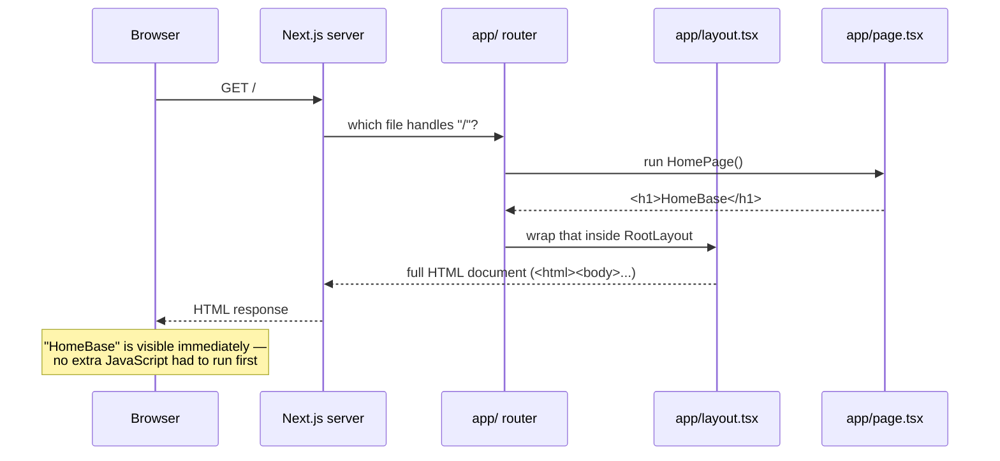
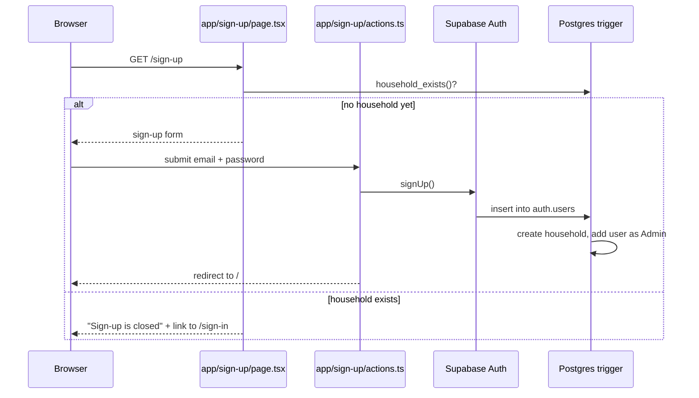
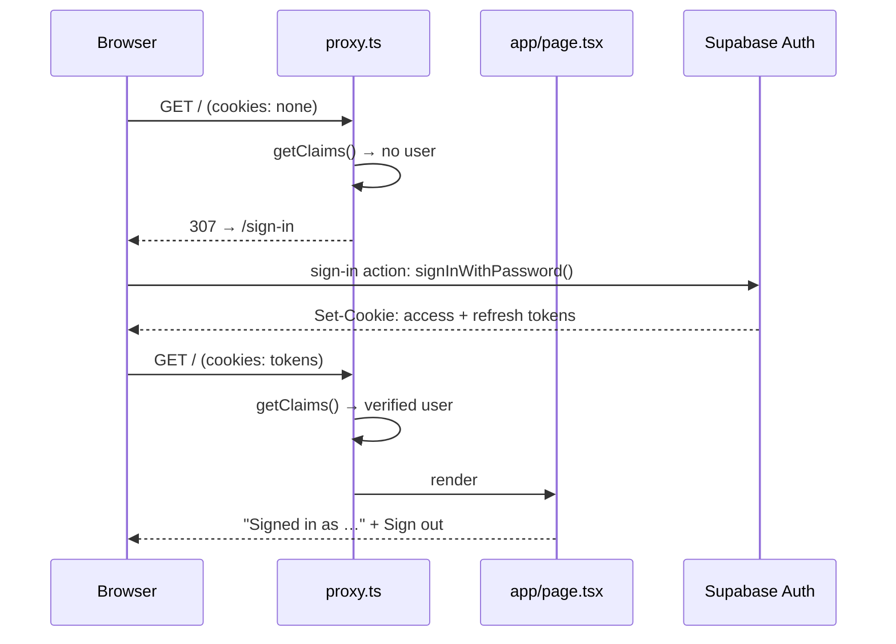
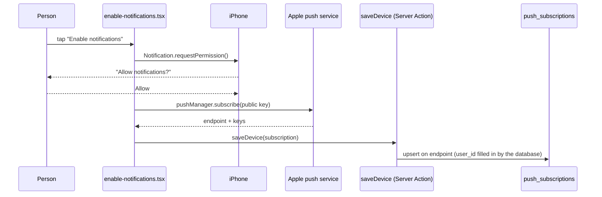
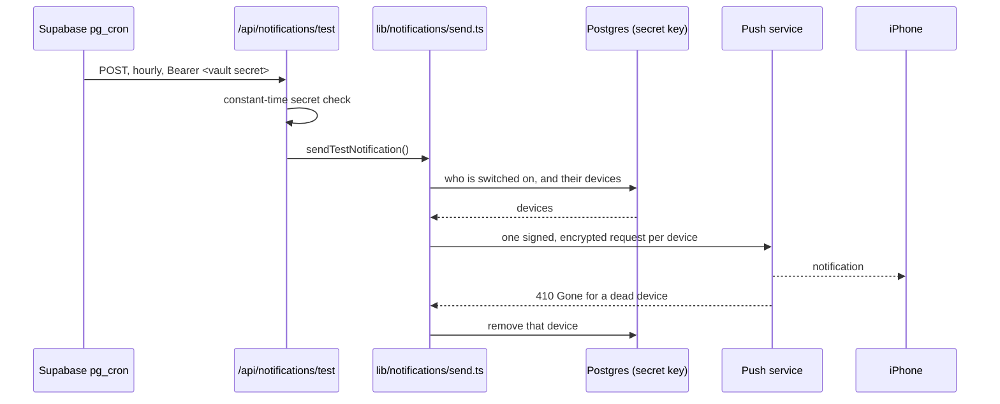
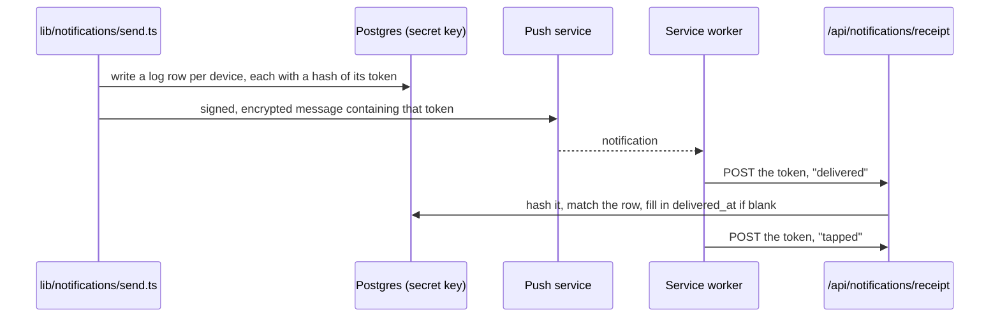
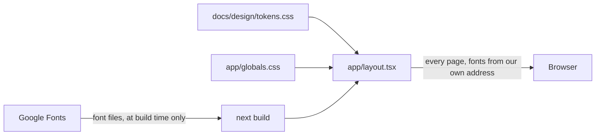
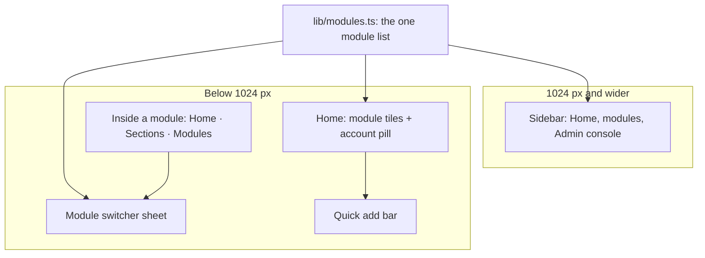
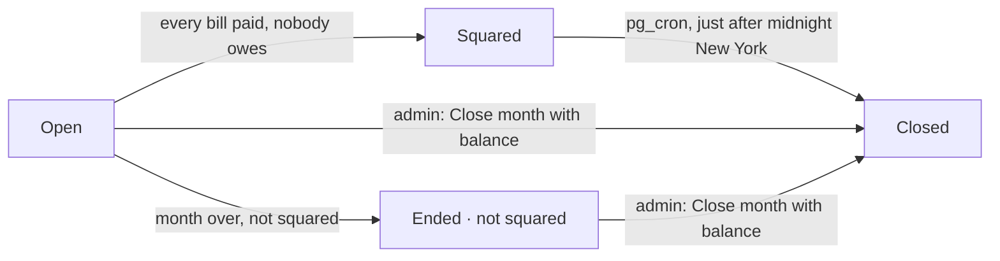

# Architecture (as of v0.0.1)

This describes how HomeBase is put together today. At this stage the app is
a signed-in homepage plus sign-up and sign-in pages — there's a database
and accounts now, but no permissions yet and no styling. This doc will grow as those pieces are added; see the "Not yet
built" section below for what's intentionally missing right now.

## What happens when a browser requests "/"

In words: the browser asks for the homepage, the Next.js server figures out
which file is responsible for that URL, runs it, wraps the result in the
shared page shell, and sends back a finished HTML page. Nothing happens on
the browser side to produce the content — it just displays what it was
given.

## The pieces

| Piece | What it does | Why it exists |
|---|---|---|
| **Next.js** | A framework built on top of React. It provides the server that listens for requests, decides which code should run for each URL, and turns the result into HTML. | Without it, we'd have to write our own server, our own routing, and our own way of turning React components into web pages. Next.js does all of that out of the box. |
| **React** | A library for describing UI as components — functions that return markup (like `<h1>HomeBase</h1>`). Next.js uses React as its templating engine. | Lets us build the page out of small, reusable, describable pieces instead of hand-writing HTML strings. |
| **`app/` routing** | Next.js's convention: the folder structure inside `app/` *is* the URL structure. A folder named `app/settings/` with a `page.tsx` inside would become the `/settings` page. Right now there's only `app/page.tsx`, so there's only one route: `/`. | Removes the need to manually configure routes — you add a folder, you get a URL. |
| **`layout.tsx`** | The shared wrapper every page renders inside. It owns the outer `<html>` and `<body>` tags, which Next.js requires exactly one of at the top level. | Any markup that should appear on *every* page (later: a header, a nav bar) goes here once, instead of being repeated on every page. |
| **`page.tsx`** | The content for one specific URL. `app/page.tsx` is the homepage because it sits directly inside `app/`. | This is where a page's actual content lives — separate from the shared shell in `layout.tsx`. |
| **TypeScript** | JavaScript with type-checking added. It catches certain mistakes (like passing the wrong kind of value to a function) while writing code, before ever running it. | Catches a class of bugs early, and makes it easier to know what a piece of code expects, especially useful when relearning a codebase after time away. |

## Server-rendered, and what that means

`app/page.tsx` runs on the server, not in the browser. By default, every
page in the App Router is a **Server Component**: Next.js runs its code
once on the server for each request, produces the resulting HTML, and sends
that finished HTML to the browser. The browser doesn't need to download or
run any JavaScript just to show "HomeBase" — it only has to display the
HTML it was handed.

This matters for two reasons: it's faster (nothing to compute in the
browser first) and it's simpler to reason about (the same code always
produces the same output, since it always runs in the same place — the
server — instead of behaving differently across browsers). Later, if a
page needs interactivity (a button that reacts to clicks, for example),
that specific piece would be marked a "Client Component" and would run in
the browser too — but nothing in this app does that yet.

## Deployment

Two external services are now part of getting code live: **GitHub Actions**
(covered in [lesson 02](lessons/02-github-actions.md)) runs checks on every
pull request, and **Vercel** builds and hosts the app.

Vercel builds automatically on every merge to `main`, but does not
automatically point the production domain at that build — that's a
deliberate setting ("Auto-assign Custom Production Domains" is disabled).
A separate GitHub Actions workflow
([`.github/workflows/promote.yml`](../.github/workflows/promote.yml)) only
assigns the production domain when a version tag (`v*`) is pushed, by
finding the build made from the exact commit the tag points to and running
the Vercel CLI's `promote` command on it — not just whatever Vercel
considers the latest build, since `main` may have moved on since the tag
was cut. If no build exists for that commit, the workflow fails loudly and
leaves production untouched. See [lesson 03](lessons/03-tags-releases-promote.md)
for the full build-vs-promote explanation and a diagram of that flow.

In short: merging to `main` builds; pushing a tag is what actually goes
live. The production address is `home-base-peach.vercel.app`.

Vercel also gives the project an address of its own,
`home-base-home-base12.vercel.app`, which does follow the newest build.
It is not production, and nothing should be judged by it — mistaking the
two is a live trap, described in
[lesson 03](lessons/03-tags-releases-promote.md).

Database structure follows the same path with one more workflow:
[`.github/workflows/migrate.yml`](../.github/workflows/migrate.yml)
applies any new file in `supabase/migrations/` to the hosted Supabase
project as soon as it lands on `main`, so the schema is never behind the
code that needs it. See [lesson 07](lessons/07-supabase-auth-and-migrations.md).

The homepage itself reads two of Vercel's build-time environment
variables (`VERCEL_GIT_COMMIT_REF`, `VERCEL_GIT_COMMIT_SHA`) and displays
them as small text, so it's possible to confirm which commit is actually
live by looking at the page itself. See
[lesson 04](lessons/04-build-time-env-vars.md) for how that works and a
limitation worth knowing (it shows the branch that built the code, not
the release tag).

## Error tracking

A third external service, **Sentry**, is now wired in: errors from both
the browser and the server are reported to it automatically, via
`instrumentation-client.ts`, `sentry.server.config.ts`,
`sentry.edge.config.ts`, and `instrumentation.ts` (which connects Next.js's
own error hook to Sentry). Configuration is a single environment variable,
`NEXT_PUBLIC_SENTRY_DSN`. See
[lesson 05](lessons/05-sentry-error-tracking.md) for what Sentry is, what a
DSN is, and what actually shows up when an error fires.

## Data and sign-up

A fourth external service, **Supabase**, now holds the data and the
accounts: a Postgres database plus an Auth service, reached through
`@supabase/supabase-js` and `@supabase/ssr`
([`lib/supabase/server.ts`](../lib/supabase/server.ts)). Database
structure lives in `supabase/migrations/` and is applied with the Supabase
CLI (`npx supabase db push`), never by hand in the dashboard. See
[lesson 07](lessons/07-supabase-auth-and-migrations.md) for what Supabase
is, how migrations work, and the reasoning below in full.

Four tables: `households`; `roles` (Admin and Member as rows, each with a
`max_holders` limit — 2 for Admin); `role_permissions`, the keys each
role holds (`use_modules`, `manage_members`, `manage_roles`); and
`household_members`, which links a user to the household with a role.

Row-level security policies decide who may do what, and every policy asks
one of two `security definer` helpers — `is_member()` or
`has_permission('…')` — never a role's name: any member reads all
household data; changing memberships needs `manage_members`; changing
roles or their permissions needs `manage_roles`. A trigger refuses a
membership that would push a role past its `max_holders`. App code uses
the same `has_permission` over RPC
([`lib/auth/permissions.ts`](../lib/auth/permissions.ts)) to decide what
to show. See [lesson 09](lessons/09-permissions-as-data-and-rls.md). The
one thing a signed-out visitor can ask is `household_exists()`, which
returns only true or false.

The rule "only the first sign-up creates a household" is enforced by that
trigger inside the database, not by the page. The page hides the form as a
courtesy once a household exists, but a request sent straight to Supabase's
sign-up endpoint hits the same trigger and is refused just the same.

After that first sign-up, accounts are created by an admin from the
console (`app/admin/`). The Server Action first writes the email into a
`member_invitations` table (only `manage_members` holders may, by RLS),
then uses the server-only `SUPABASE_SECRET_KEY`
([`lib/supabase/admin.ts`](../lib/supabase/admin.ts)) to create the user
with a temporary password. The trigger admits the new user only because
that invitation exists, grants the invited role (Member by default), and
deletes the invitation. Invitations expire ten minutes after they are
written and the trigger ignores expired ones, so a row left behind by a
create that died mid-way cannot admit anyone later; the admin action
clears expired rows before writing a new one.
A `must_set_password` flag in `app_metadata` —
which only the secret key can write — is read by the proxy from the login
token to send the person to `/set-password` before anything else. No
email is sent. See [lesson 11](lessons/11-creating-accounts-for-others.md).

The console then lists every member — name and email come from the
private `auth.users` table through `household_members_overview()`, a
`security definer` function that returns rows only to `manage_members`
holders — with a role dropdown fed from the `roles` table and a
password-reset form. Role changes are plain updates to
`household_members`, guarded by RLS and by two triggers reading the role's
`max_holders` and `min_holders` (Admin: at most 2, at least 1), so the
only admin cannot demote themselves. A floor guards a *living* household:
it also refuses to let the last admin's account be deleted, which would
leave the other members with nobody able to manage them, but it stands
aside when the household row itself is deleted and its memberships
cascade away. Tearing a household down therefore means deleting the
household first, then the accounts. A reset sets a temporary password and
`must_set_password` through the secret key; Supabase signs the member out
everywhere, and their next sign-in lands on `/set-password`. See
[lesson 12](lessons/12-the-member-ledger.md).

Each membership also carries a `notifications_enabled` flag, off by
default, which an admin turns on or off from the roster. Row-level
security decides which *rows* you may read; this flag needed the
column-level equivalent, so the table-wide `select` grant on
`household_members` was withdrawn from `authenticated` and re-granted
column by column, leaving this one out. Members therefore still read
every membership row but cannot see, or ask for, who has notifications
on — not even with `select=*`, which now fails rather than quietly
omitting it. `anon` had its grant withdrawn and nothing handed back, so a
signed-out visitor can read no column of this table at all; the policies
were already `to authenticated`, and this is the second layer. The roster function is `security definer`, so it
runs as the table's owner and can still return the flag to
`manage_members` holders.

That makes the roster function the only way to read the flag, and it
requires `manage_members` — which a background job, having no signed-in
user, will never hold. So the sender in REQ-21 needs its own route to it,
either as `service_role` or through a second `security definer` function
written for a caller that is nobody. Nothing sends notifications yet.

## Sign-in and sessions

Signing in (`app/sign-in/`) calls Supabase Auth with the email and
password; on success Supabase issues an access token and a refresh token,
which `@supabase/ssr` stores in cookies. From then on, one file runs
before every page:
[`proxy.ts`](../proxy.ts) — Next.js's request interceptor (formerly
`middleware.ts`). It refreshes the session if needed and applies the
routing rule in [`lib/auth/routing.ts`](../lib/auth/routing.ts): signed
out → `/sign-in` (except `/sign-in` and `/sign-up` themselves); signed in
→ everything else. See [lesson 08](lessons/08-sessions-and-the-proxy.md)
for what a session is, why the check verifies the token's signature rather
than trusting the cookie, and the devices-are-independent rules.

Sign-out (`app/sign-out/actions.ts`) ends this device's session only and
sends the visitor back to `/sign-in`.

## Admin access

A role decides what someone *may* do. Admins reach the console at
[`app/admin/`](../app/admin/page.tsx) from the sidebar on a desktop, and
on a phone from the account pill's menu on Home
([`components/account-menu.tsx`](../components/account-menu.tsx)). Both
are shown only to holders of `manage_members`. The console checks the
same permission itself, so hiding the way in is a courtesy and the
page's check is the lock: a member who types `/admin` is sent home. Both ask for the
permission, never a role's name.

v0.1 also had an admin *mode*: admins saw the member view until they
switched, and a session cookie remembered the switch. The v0.2 design
dropped it (a Notion decision of 2026-09-21), and with it the switch, the
cookie and its code. See [lesson 10](lessons/10-modes-are-not-roles.md).

## Installing on iPhone

[`app/manifest.ts`](../app/manifest.ts) produces the web app manifest,
served at `/manifest.webmanifest` and linked from every page: the name
HomeBase, `start_url: "/"`, `display: "standalone"` (full screen, no
address bar) and two icons in `public/` (192 and 512 pixels).
[`app/layout.tsx`](../app/layout.tsx)'s `metadata` adds what iOS reads
from each page's head: a 180 pixel `apple-touch-icon` and the home-screen
title. Full screen comes from the manifest's `display`.

Every icon file is made from the design's icon by
[`scripts/export-icons.sh`](../scripts/export-icons.sh). The home-screen
PNGs are exported square, because iPhones round an app icon's corners
themselves. The browser tab gets the design's `icon.svg` as drawn, with a
`favicon.ico` for browsers that can't show SVG. `metadata` lists every
icon link. Once a layout lists icons itself, Next.js stops linking icon
files kept in `app/`, so they all live in `public/`.

Phones fetch the manifest without cookies, so the proxy's `matcher` skips
it, next to `favicon.ico`. Otherwise the proxy would find no sign-in and
answer with the sign-in page. The icon files end in `.png`, `.svg` or
`.ico`, which the matcher already skipped. None of them holds anything
private.

Staying signed in across opens of the installed app rests on the session
cookies' 400-day lifetime, which `@supabase/ssr` sets and renews on every
refresh. Tests pin it where our code writes those cookies: at sign-in,
through [`lib/supabase/server.ts`](../lib/supabase/server.ts), and at
renewal, in the proxy. See
[lesson 13](lessons/13-installing-on-the-iphone.md).

## Turning notifications on

The account menu's Settings sheet carries a small browser-side control,
[`app/notifications/enable-notifications.tsx`](../app/notifications/enable-notifications.tsx).
The control shows only in that sheet, but Home runs the same check on
every load, out of sight (`KeepThisDevice`).
In a normal browser tab it explains that notifications need the
home-screen install. In the installed app it registers the service
worker, [`public/sw.js`](../public/sw.js), which the phone keeps running
in the background to receive and show notifications. It then offers
**Enable notifications**, which asks the phone's permission as the first
thing the tap does.

On a yes, the browser's `pushManager.subscribe()` returns a subscription
from the phone's push service (Apple's, for an iPhone). The subscription
is an address (`endpoint`) plus two keys that let a sender encrypt for
that one device. It's made against the app's public push key,
`NEXT_PUBLIC_VAPID_PUBLIC_KEY`, which the server page hands to the
control. Its private half, `VAPID_PRIVATE_KEY`, waits in Vercel for the
sender in REQ-21. The Server Action
[`app/notifications/actions.ts`](../app/notifications/actions.ts) saves
the subscription to a new table:

Saving also writes the device's address into a `homebase-device` cookie
(`httpOnly`), which is how sign-out knows which device this browser is.
[`app/sign-out/sign-out-form.tsx`](../app/sign-out/sign-out-form.tsx)
first asks the push service to forget this device, then
[`app/sign-out/actions.ts`](../app/sign-out/actions.ts) removes that one
row and clears the cookie before ending the session — in that order,
since the delete needs the session. A failed clean-up is logged and
sign-out continues. Their other devices keep their notifications.

Two guards keep this from enrolling the wrong person: the control only
confirms an existing subscription when its address matches that cookie,
so anyone else must tap Enable; and signing in
([`app/sign-in/actions.ts`](../app/sign-in/actions.ts)) clears the
cookie left by whoever was here before. If an address is still held by
someone who never signed out, tapping Enable unsubscribes, signs up
again for a fresh address and saves that.

`push_subscriptions` holds one row per device (`endpoint` is unique,
`user_id` isn't), so a person can have several. `user_id` defaults to
`auth.uid()` and references `household_members`, so leaving the household
removes the devices. Row-level security lets each member see, add,
change and remove only their own rows, and every policy also asks
`is_member()`. `anon` has no grants at all. A check constraint accepts
only the push services' own addresses (Apple, Google, Mozilla,
Microsoft), because the sender will call every address stored here.
Like the notifications flag, nobody but the device's owner can read
these rows through the API, so REQ-21's sender will need `service_role`.

The service worker skips the proxy, like the manifest does. The phone
re-checks it in the background, and it refuses a service worker that
answers with a redirect, which is what a lapsed sign-in would otherwise
produce. See [lesson 14](lessons/14-turning-notifications-on.md).

## Sending the test notification

[`lib/notifications/send.ts`](../lib/notifications/send.ts) is the only
place anything is sent. It reads who is switched on
(`household_members.notifications_enabled`) and their devices
(`push_subscriptions`) with the **secret key**, because both are private
to their owner and a scheduled job has nobody signed in. It signs and
encrypts each message with `web-push` — a new dependency, and the
standard one for this — using `NEXT_PUBLIC_VAPID_PUBLIC_KEY` and
`VAPID_PRIVATE_KEY` from Vercel, with the app's own address as the
contact the push services require (written as `https` even on localhost,
which they insist on). A device whose push service answers `404` or
`410 Gone` has its row removed.

Two things start a send:

- **The hourly schedule.** Vercel's free plan allows only a daily job, so
  the clock lives in the database:
  [`supabase/migrations/20260919190000_hourly_test_notification.sql`](../supabase/migrations/20260919190000_hourly_test_notification.sql)
  adds `pg_cron` and `pg_net` and schedules `0 * * * *`, which calls
  [`app/api/notifications/test/route.ts`](../app/api/notifications/test/route.ts).
  The address and a shared secret live in Supabase's vault
  (`notify_url`, `notify_secret`), never in git; until both exist the job
  does nothing. The route has no session to check — the database isn't a
  person — so it compares the secret against `NOTIFY_SECRET` in constant
  time, and the proxy's matcher skips just that one path. Vercel's own
  Deployment Protection is off for this reason and one bigger one: it
  would have required every visitor, household members included, to hold
  a Vercel account. HomeBase's invite-only sign-in is the real gate.
- **"Send test now"** in the admin console
  ([`app/admin/send-test-form.tsx`](../app/admin/send-test-form.tsx)),
  behind `manage_members` like everything else there, which calls the
  same sender.

See [lesson 15](lessons/15-sending-a-notification.md).

## The notification log

[`supabase/migrations/20260920060000_notification_log.sql`](../supabase/migrations/20260920060000_notification_log.sql)
adds `notification_log`: one row per notification per device, holding when
it was sent, what triggered it, whose it was, which device, and when (or
whether) it arrived and was tapped.

Only the sender and the receipt address write to it, both with the
**secret key**. There is no insert, update or delete policy at all, so
nobody signed in can write to it directly — and what is stored is a
**hash** of each receipt token rather than the token, so an admin reading
the log cannot quote one back to record a delivery that never happened
either. Admins can
read it, which is the first time an admin can see anything about another
member's notifications — REQ-16 and REQ-20 deliberately hid switches and
devices even from admins. What is exposed is narrower: times, and a
one-way **fingerprint** of the device rather than its push address, which
is the thing that would let anyone send to that phone.

Delivery is reported by the phone itself, because nothing else knows.
[`public/sw.js`](../public/sw.js) calls
[`app/api/notifications/receipt/route.ts`](../app/api/notifications/receipt/route.ts)
when a notification shows and again when it is tapped. That call carries
no session — a notification can arrive for someone signed out — so it
proves itself with a **receipt token**: a random secret placed inside
that one encrypted message, so only the device it was sent to can quote
it. The address hashes what arrives and matches that against the log. It
answers `204` to everything, so it cannot be used to test guesses, and
the proxy's matcher skips it for the same reason it skips the hourly
address. It is open to the internet and unthrottled; the blast radius is
one row, but the request volume is not bounded.

The log rows are written **before** the notifications are sent. A push
can be delivered and reported back in well under a second, and a receipt
that arrives before its row exists would be lost.

"Missing after 5 minutes" is worked out when the log is read
([`lib/notifications/log.ts`](../lib/notifications/log.ts)), not stored,
so the rule lives in one place and can be tightened without a migration.
A daily `pg_cron` job deletes entries older than 30 days.

See [lesson 16](lessons/16-the-notification-log.md).

## Look and feel

The design lives in [`docs/design/`](design/): the rules in `DESIGN.md`,
reference mockups, the app icon, and
[`tokens.css`](design/tokens.css), which writes every colour, font,
corner size and spacing value down once as a named CSS variable (a
*token*). The root layout ([`app/layout.tsx`](../app/layout.tsx)) loads
that file straight from the design folder, so the app and the design
read the same file and can't drift apart. It then loads
[`app/globals.css`](../app/globals.css), the base every page starts from:
warm-white ground, ink text, the body font on everything including form
controls, and the display font at weight 800 on headings.

Styles name tokens (`var(--color-muted)`), never raw values.
[`app/no-raw-design-values.test.ts`](../app/no-raw-design-values.test.ts)
reads every stylesheet and component and fails on a raw colour, font or
corner size, and on a token name that doesn't exist. A browser raises no
error for a misspelt token; it quietly resets that colour or size to its
default.

The fonts come through `next/font` ([`app/fonts.ts`](../app/fonts.ts)),
which is part of Next.js rather than a new dependency. It adds a new
outside service, but only at build time: while the app is built (on
Vercel, and in CI) it downloads Bricolage Grotesque and Plus Jakarta Sans
from Google Fonts, and the app then serves them from its own address.
Opening HomeBase never contacts Google. If Google Fonts can't be reached,
the build fails rather than shipping without the fonts; that was checked
by building through a dead proxy.

Each font's name reaches the tokens through a CSS variable set on
`<html>`, together with a system font resized to the same proportions,
which stands in until the file arrives so text doesn't jump. See
[lesson 17](lessons/17-design-tokens-and-fonts.md).

Pieces used on more than one page live in
[`components/`](../components/), starting with the brand lockup: the
icon beside "HomeBase". Each has its own stylesheet, a **CSS Module**
(`brand-lockup.module.css`), whose class names Next.js makes unique to
that component, so one component's styles can't leak onto another's.
Forms used by a single page still live next to it.

## Phone and desktop layouts

Every signed-in page sits in one frame,
[`components/app-frame.tsx`](../components/app-frame.tsx), which holds
both layouts at once. Below 1024 px wide the stylesheets show the phone
one: the page scrolls, and a bar stays fixed at the bottom. From 1024 px
they show the desktop one: a sidebar
([`components/sidebar.tsx`](../components/sidebar.tsx)) beside the page.
The width decides alone, with no device detection, so resizing a window
switches on the spot. A stylesheet can't read a token inside `@media`, so
each states `1024px` itself, and a test holds every one of them to
`--breakpoint-desktop`.

The modules come from one list in code,
[`lib/modules.ts`](../lib/modules.ts): name, slug, token prefix, home
page and sections. Home's tiles, the sidebar and the phone's module
switcher all draw from it, so a new module is a new entry. v0.2 lists
all six but gives only Finances a page (`/finances`, an empty shell). The
other five show without a link, per a Notion decision of 2026-09-21. A
module's colours reach its components as `--module-*` variables built
from its token prefix, and a test checks every prefix has all six
colours.

What each tile says comes from
[`lib/module-status.ts`](../lib/module-status.ts): a status line for a
phone, a headline and two facts for a desktop, and the module's action
items. A tile is loud, in its module's solid colour, if and only if the
module has an action item. No module has data yet, so that file is a
stand-in: every module is quiet and says "Coming soon", unless `?demo`
is in Home's address, which swaps in the design's invented example (a
Notion decision of 2026-09-21). Home draws tiles only for modules that
are switched on; the admin console's switches come later, so for now
none is off.

The action items card at the top of Home reads the same stand-in: each
item carries an urgency rank, and Home shows the three most urgent
across the switched-on modules, so a loud tile's item is always there
unless three more urgent ones fill the card. `?demo=0` to `?demo=4` show
each state of the card, from All clear to more items than fit. The card
([`components/action-items.tsx`](../components/action-items.tsx)) is
one list that scrolls sideways and snaps to one card at a time on a
phone, and lays the cards side by side on a desktop. It runs in the
browser, to keep the "1 / 3" counter in step with the swipe.

On a phone, Home has no navigation bar: the tiles and the account pill do
that job, and Quick add stays at the bottom. Inside a module the bottom
bar is Home · Sections · Modules. Sections and Modules open **bottom
sheets** ([`components/bottom-sheet.tsx`](../components/bottom-sheet.tsx)),
built on the browser's own `<dialog>`. These are the first interactive
pieces of the frame, so they run in the browser as Client Components.
So does Home's greeting, because only the phone knows its own time of
day. `same-capabilities.test.tsx` renders the pages and checks that
every place the desktop sidebar reaches is reachable without it.

The layout meets the phone's edges with `viewport-fit=cover` and the
screen's safe-area insets, so content clears the notch and the home bar.
That part has not been checked on an iPhone. See
[lesson 18](lessons/18-one-app-two-layouts.md).

## Finances setup: the split, income and bills

The first real Finances data (REQ-50, 51, 94) is the yearly setup an
admin does in the Budget year section, `/finances/budget-year`. Four
tables, all in the one household, so none carries a household id:

| Table | One row is | Key facts |
|---|---|---|
| `splits` | a percentage set that starts in a month | `effective_from` (the 1st of that month, unique), `note` |
| `split_shares` | one person's percentage in that split | `split_id`, `user_id`, `percent` |
| `income_sources` | one person's regular pay | `name`, `owner_id`, `net_amount`, `cadence` (weekly, biweekly, monthly), `anchor_date` |
| `bills` | one recurring bill | `name`, `kind` (rent, card, other), `due_day`, `amount` (rent only: the same every month) |

A split holds until a later one starts, so the household can change the
percentages mid-year without touching the months already run: a month
uses the split in force when it opens (REQ-52). A split whose month has passed is what those
months were worked out from, so it stays as it is. Saving over it or
editing it is refused three times: by the screen, by the server action,
and by `save_split()` in the database. Removing it is refused by the
screen and the server action only — a delete rule in the database would
have to read the database server's own clock, which is the thing
lesson 20 argues against. The month now running is still open, which is
how the first split is saved. An income source is never rewritten either — changing one sets
`ended_on` on the old row and starts a new one from the same day, so
paydays already past keep their amount. A source is in force on a day
when `effective_from <= day` and (`ended_on` is null or `day <
ended_on`); both dates come from `householdToday()`, passed in, never
from the database server's own clock.

Any member reads all of them; writing needs the `manage_budget`
permission, which the migration gives to Admin. A split's percentages
must total 100:
a constraint trigger checks the sum when a transaction that saves a year
or a share commits (deleting a share, as when a person leaves, isn't
checked, so the total can then drop below 100), and
`save_split()` writes a split and all its shares in one transaction
so the check sees the whole set. It runs as the caller, so the policies
still decide who may save. `household_people()` lists each member's name
(or their email's first part) and whether they manage the budget, for
the split form, income owners, and the first-run message a member sees.

Every Finances date decision reads one clock: `householdToday()` in
`lib/finances/budget-year.ts`, set to `America/New_York` because that is
where the household is. The budget year, the month and the paydays
therefore turn over on the household's own day, not the server's.

The budget year itself is not stored, and nothing needs it any more: a
split carries its own month, so the April-to-March frame comes back only
when the March review (REQ-69) is built. Paydays are
projected the same way (`payDates` in `lib/finances/income.ts`) from one
real payday, so nothing is stored per payday.

## Finances months: monthly entry

A month exists once someone opens it in Monthly entry,
`/finances/monthly-entry` (REQ-53, 54, 55). Four more tables:

| Table | One row is | Key facts |
|---|---|---|
| `months` | an opened month | `starts_on` (the 1st, unique) |
| `month_bills` | one bill in that month, copied from `bills` when it opened | `name`, `kind`, `due_day` (copies), `amount`, `personal_answer` (none, some) |
| `personal_charges` | a charge inside a card statement that is one person's | `month_bill_id`, `owner_id`, `amount`, `note` |
| `direct_payments` | shared spend one person paid off the tracked cards ("one-time payments" on screen) | `month_id`, `payer_id`, `amount`, `note`, `paid_on` |

`open_month()` opens only the month now running (the day passed in from
`householdToday()`) and copies the bill list in (rent arrives already
entered, with its amount from the bill), so a bill changed or
removed later reaches only months opened after that (REQ-94). While the
month now running is open, the Budget year form asks whether it takes a
change too: `save_bill()` adds or updates its copy (a change to or from
a card clears that bill's entry; a rent amount becomes the month's figure), and `remove_bill()` sets a not-yet-entered
copy to $0 rather than deleting it. Both check `manage_budget`
themselves, since members can't write a month bill's name or type. Entering
is shared: any member with `use_modules` enters amounts and adds or
removes charges and payments, and everyone reads them. A member may
change only a month bill's amount and answer, not its copied name, kind
or due day (column-level grants). A card statement can't hold an amount
without an answer (a check constraint); `enter_bill()` clears the
charges when the answer goes back to "none"; and a trigger refuses
charges that come to more than the statement.

The money is worked out in code, not stored: `monthTotals()` in
`lib/finances/month.ts` adds the entered bills, takes the personal
charges out and adds the direct payments to get the shared base, then
gives each person their percentage of it, plus their own charges.

## Finances months: payments and who owes what

A payment is money one person sent to one of the month's bills,
logged on `/finances/log-payment` (REQ-57). One more table:

| Table | One row is | Key facts |
|---|---|---|
| `payments` | money one person paid toward one month bill | `month_bill_id`, `payer_id`, `amount` |

Logging is shared like entering: any member with `use_modules` logs,
changes or deletes a payment for either person. A trigger checked at
both doors refuses a bill's payments coming to more than the bill:
when a payment is logged or changed, and when the bill's amount is
changed (a bill not entered counts as $0, so it can't be paid toward).
The page says the same thing in words first.

`monthTotals()` then gives each person their obligation, what they paid
(payments toward bills plus any one-time payment they fronted) and what
is outstanding, and each bill its paid and left (REQ-56, 58). Each share
is rounded to the cent, and the last person takes the cent the rounding
left over, so the obligations always add up to the bills plus one-time
payments exactly. Finances home shows the result for the month picked
(REQ-92): a card per person, the bills with paid of total, and the
workings folded under the cards. The month runs on the split that had
started by its 1st, until it closes.

## Finances months: closing, income and the verdict

A month closes like a paper ledger being signed off (REQ-59, 52): what
it was split by and what was still owed are written onto it, and then
nothing in it changes.

| Table / column | One row is | Key facts |
|---|---|---|
| `months.closed_at`, `closed_by`, `closed_automatically`, `split_from` | when it closed, which admin, whether the nightly job did it, the month its split started | set only by `close_month()` |
| `month_people` | one person on a closed month | `percent` at the time, `outstanding` when it closed; no one writes it directly |
| `month_income` | money that landed in a month (REQ-60) | `kind` paycheck / espp / rsu / bonus / other, `owner_id`, `amount`, `received_on`; a confirmed paycheck keeps `income_source_id` |

- **Squared** is worked out twice, on purpose: `monthStatus()` in the
  app for the header chip, and `month_balances()` / `month_is_squared()`
  in the database for the nightly close, which runs without the app.
  Both use the same rule, including who takes the rounding cent.
- **The nightly close** is a pg_cron job, `close-squared-months`, at
  five past every hour (UTC). It does its work only in the hour after
  midnight in New York, which lands on a different UTC hour in summer
  and winter.
- **Closing with a balance** is `close_month_with_balance()`: admins
  only (`manage_budget`), every bill entered. Nothing carries into the
  next month; the unpaid amount comes back on the real statement and is
  declared as that person's personal charge.
- **The lock** is a trigger on `month_bills`, `personal_charges`,
  `direct_payments` and `payments` that refuses any insert, change or
  delete in a closed month. Removing a bill from the household list is
  let through (it only empties the copy's `bill_id`). Removing a member
  who appears on a closed month is refused (`month_people` restricts
  it), so the record never loses a person.
- `month_balances()` and `month_is_squared()` are for the database's
  own use only; signed-in users can't call them.
- **Income** isn't locked by closing alone: a month can square and
  close mid-month while pay is still to land, so income locks once the
  month is closed *and* over.

`/finances/income` lists the paychecks the income sources expect up to
today, to confirm, and takes any other income by hand. Finances home's
verdict card is each person's income minus their obligation, and the
two together (REQ-61).

### Savings

What a month allows into joint savings is worked out, never stored:
`savingsPlan()` in `lib/finances/savings.ts` takes each person's
leftover and has each put in half the lower one, rounded down to the
dollar (REQ-63). If anyone's leftover is zero or below, nobody saves
jointly and the verdict card says why in words (REQ-64). Only what was
actually put away is stored (REQ-66):

| Table | One row is | Key facts |
|---|---|---|
| `month_savings` | one person's savings for a month | `to_joint`, `own`, both 0 or more; any member records, corrects or removes it for either person, and it stays open after the month closes, because saving happens after the month ends |

`/finances/savings` shows this month's plan, the form, and each closed
month with what was saved beside what was available.

## Finances balances

Each person's account balances, entered once a month (REQ-67). A
balance month is a plain calendar month, not a row in `months`: balances
can be entered whether or not that month's bills were opened, and
closing a month doesn't lock them.

| Table | One row is | Key facts |
|---|---|---|
| `balances` | one person's balance in one account for a month | `month` (the 1st), `user_id`, `account` (401k, espp, rsu, investments, cash), `amount` 0 or more; an account left blank has no row, so the gap shows; any member enters, corrects or removes either person's |

Everything else is worked out in `lib/finances/balances.ts`:
`startingPoint()` pre-fills a box from the latest earlier month,
`balanceTrend()` gives each month's total, its change (over the accounts entered in both months, labelled "on the same accounts" when one is missing) and every
account's change (REQ-68), and `cashCheck()` sets a person's cash beside
their leftover from `leftovers()`, flagging more than `CASH_GAP_FLAG`
($500) over (REQ-65). `/finances/balances` shows the form, the cash
check and the trend. On desktop, an SVG line chart drawn in our own
code (`chart.tsx`, no chart library) shows the total.

## Not yet built

These are deliberately absent at this stage, not overlooked:

- **Little state** — the forms' pending/error state, the notifications
  control, which checks the device when the page opens and changes as the
  phone's question is answered, and which sheet is open.
- **Screens still to design** — Sign-in, sign-up and set-password have
  no mockup, so they keep a plain layout in the design's fonts and
  colours.
- **The rest of Finances** — balances, action items and reminders
  arrive in batches after the months above.

Each of these will get its own entry in this document (and likely its own
diagram) once it exists.
