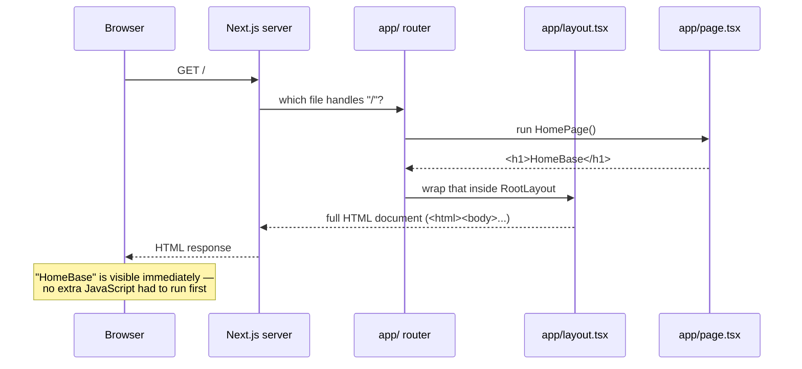
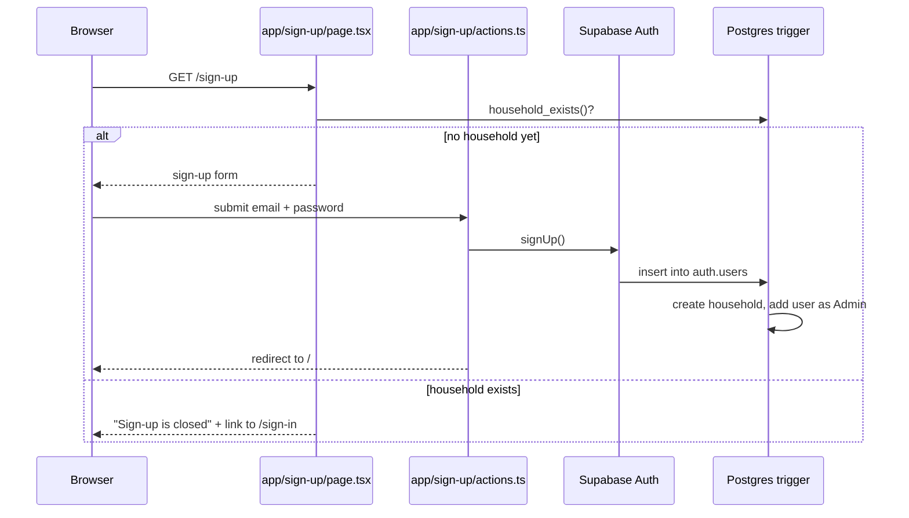
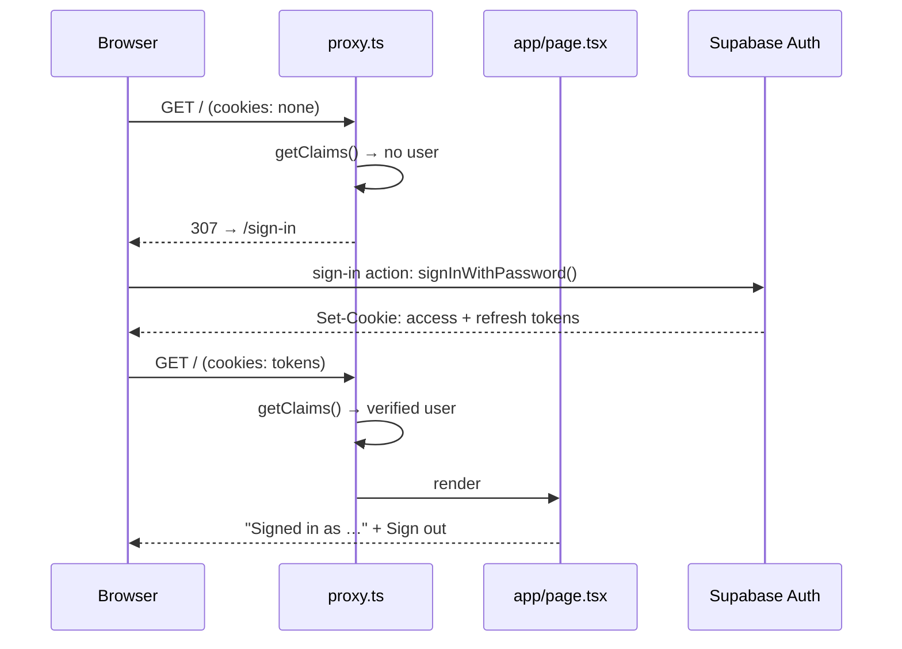
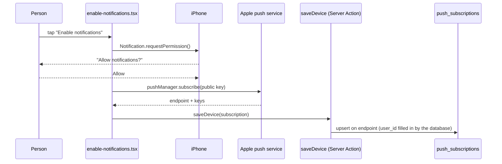
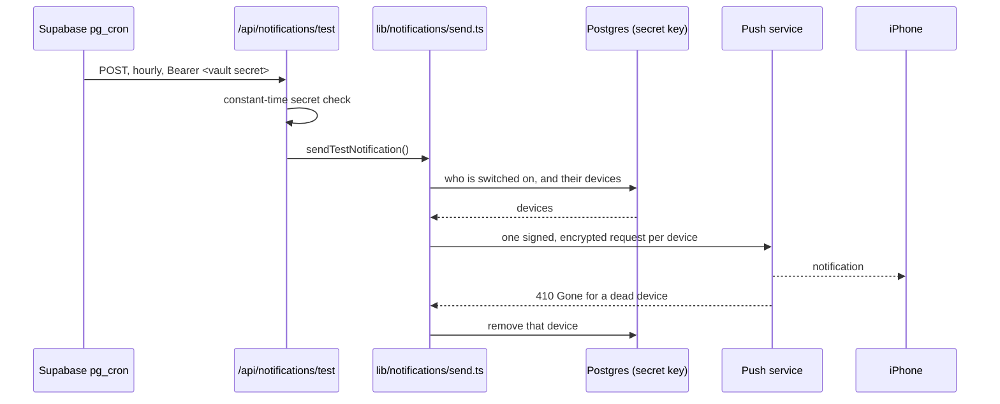

# Architecture (as of v0.0.1)

This describes how HomeBase is put together today. At this stage the app is
a signed-in homepage plus sign-up and sign-in pages — there's a database
and accounts now, but no permissions yet and no styling. This doc will grow as those pieces are added; see the "Not yet
built" section below for what's intentionally missing right now.

## What happens when a browser requests "/"

In words: the browser asks for the homepage, the Next.js server figures out
which file is responsible for that URL, runs it, wraps the result in the
shared page shell, and sends back a finished HTML page. Nothing happens on
the browser side to produce the content — it just displays what it was
given.

## The pieces

| Piece | What it does | Why it exists |
|---|---|---|
| **Next.js** | A framework built on top of React. It provides the server that listens for requests, decides which code should run for each URL, and turns the result into HTML. | Without it, we'd have to write our own server, our own routing, and our own way of turning React components into web pages. Next.js does all of that out of the box. |
| **React** | A library for describing UI as components — functions that return markup (like `<h1>HomeBase</h1>`). Next.js uses React as its templating engine. | Lets us build the page out of small, reusable, describable pieces instead of hand-writing HTML strings. |
| **`app/` routing** | Next.js's convention: the folder structure inside `app/` *is* the URL structure. A folder named `app/settings/` with a `page.tsx` inside would become the `/settings` page. Right now there's only `app/page.tsx`, so there's only one route: `/`. | Removes the need to manually configure routes — you add a folder, you get a URL. |
| **`layout.tsx`** | The shared wrapper every page renders inside. It owns the outer `<html>` and `<body>` tags, which Next.js requires exactly one of at the top level. | Any markup that should appear on *every* page (later: a header, a nav bar) goes here once, instead of being repeated on every page. |
| **`page.tsx`** | The content for one specific URL. `app/page.tsx` is the homepage because it sits directly inside `app/`. | This is where a page's actual content lives — separate from the shared shell in `layout.tsx`. |
| **TypeScript** | JavaScript with type-checking added. It catches certain mistakes (like passing the wrong kind of value to a function) while writing code, before ever running it. | Catches a class of bugs early, and makes it easier to know what a piece of code expects, especially useful when relearning a codebase after time away. |

## Server-rendered, and what that means

`app/page.tsx` runs on the server, not in the browser. By default, every
page in the App Router is a **Server Component**: Next.js runs its code
once on the server for each request, produces the resulting HTML, and sends
that finished HTML to the browser. The browser doesn't need to download or
run any JavaScript just to show "HomeBase" — it only has to display the
HTML it was handed.

This matters for two reasons: it's faster (nothing to compute in the
browser first) and it's simpler to reason about (the same code always
produces the same output, since it always runs in the same place — the
server — instead of behaving differently across browsers). Later, if a
page needs interactivity (a button that reacts to clicks, for example),
that specific piece would be marked a "Client Component" and would run in
the browser too — but nothing in this app does that yet.

## Deployment

Two external services are now part of getting code live: **GitHub Actions**
(covered in [lesson 02](lessons/02-github-actions.md)) runs checks on every
pull request, and **Vercel** builds and hosts the app.

Vercel builds automatically on every merge to `main`, but does not
automatically point the production domain at that build — that's a
deliberate setting ("Auto-assign Custom Production Domains" is disabled).
A separate GitHub Actions workflow
([`.github/workflows/promote.yml`](../.github/workflows/promote.yml)) only
assigns the production domain when a version tag (`v*`) is pushed, by
finding the build made from the exact commit the tag points to and running
the Vercel CLI's `promote` command on it — not just whatever Vercel
considers the latest build, since `main` may have moved on since the tag
was cut. If no build exists for that commit, the workflow fails loudly and
leaves production untouched. See [lesson 03](lessons/03-tags-releases-promote.md)
for the full build-vs-promote explanation and a diagram of that flow.

In short: merging to `main` builds; pushing a tag is what actually goes
live.

Database structure follows the same path with one more workflow:
[`.github/workflows/migrate.yml`](../.github/workflows/migrate.yml)
applies any new file in `supabase/migrations/` to the hosted Supabase
project as soon as it lands on `main`, so the schema is never behind the
code that needs it. See [lesson 07](lessons/07-supabase-auth-and-migrations.md).

The homepage itself reads two of Vercel's build-time environment
variables (`VERCEL_GIT_COMMIT_REF`, `VERCEL_GIT_COMMIT_SHA`) and displays
them as small text, so it's possible to confirm which commit is actually
live by looking at the page itself. See
[lesson 04](lessons/04-build-time-env-vars.md) for how that works and a
limitation worth knowing (it shows the branch that built the code, not
the release tag).

## Error tracking

A third external service, **Sentry**, is now wired in: errors from both
the browser and the server are reported to it automatically, via
`instrumentation-client.ts`, `sentry.server.config.ts`,
`sentry.edge.config.ts`, and `instrumentation.ts` (which connects Next.js's
own error hook to Sentry). Configuration is a single environment variable,
`NEXT_PUBLIC_SENTRY_DSN`. See
[lesson 05](lessons/05-sentry-error-tracking.md) for what Sentry is, what a
DSN is, and what actually shows up when an error fires.

## Data and sign-up

A fourth external service, **Supabase**, now holds the data and the
accounts: a Postgres database plus an Auth service, reached through
`@supabase/supabase-js` and `@supabase/ssr`
([`lib/supabase/server.ts`](../lib/supabase/server.ts)). Database
structure lives in `supabase/migrations/` and is applied with the Supabase
CLI (`npx supabase db push`), never by hand in the dashboard. See
[lesson 07](lessons/07-supabase-auth-and-migrations.md) for what Supabase
is, how migrations work, and the reasoning below in full.

Four tables: `households`; `roles` (Admin and Member as rows, each with a
`max_holders` limit — 2 for Admin); `role_permissions`, the keys each
role holds (`use_modules`, `manage_members`, `manage_roles`); and
`household_members`, which links a user to the household with a role.

Row-level security policies decide who may do what, and every policy asks
one of two `security definer` helpers — `is_member()` or
`has_permission('…')` — never a role's name: any member reads all
household data; changing memberships needs `manage_members`; changing
roles or their permissions needs `manage_roles`. A trigger refuses a
membership that would push a role past its `max_holders`. App code uses
the same `has_permission` over RPC
([`lib/auth/permissions.ts`](../lib/auth/permissions.ts)) to decide what
to show. See [lesson 09](lessons/09-permissions-as-data-and-rls.md). The
one thing a signed-out visitor can ask is `household_exists()`, which
returns only true or false.

The rule "only the first sign-up creates a household" is enforced by that
trigger inside the database, not by the page. The page hides the form as a
courtesy once a household exists, but a request sent straight to Supabase's
sign-up endpoint hits the same trigger and is refused just the same.

After that first sign-up, accounts are created by an admin from the
console (`app/admin/`). The Server Action first writes the email into a
`member_invitations` table (only `manage_members` holders may, by RLS),
then uses the server-only `SUPABASE_SECRET_KEY`
([`lib/supabase/admin.ts`](../lib/supabase/admin.ts)) to create the user
with a temporary password. The trigger admits the new user only because
that invitation exists, grants the invited role (Member by default), and
deletes the invitation. Invitations expire ten minutes after they are
written and the trigger ignores expired ones, so a row left behind by a
create that died mid-way cannot admit anyone later; the admin action
clears expired rows before writing a new one.
A `must_set_password` flag in `app_metadata` —
which only the secret key can write — is read by the proxy from the login
token to send the person to `/set-password` before anything else. No
email is sent. See [lesson 11](lessons/11-creating-accounts-for-others.md).

The console then lists every member — name and email come from the
private `auth.users` table through `household_members_overview()`, a
`security definer` function that returns rows only to `manage_members`
holders — with a role dropdown fed from the `roles` table and a
password-reset form. Role changes are plain updates to
`household_members`, guarded by RLS and by two triggers reading the role's
`max_holders` and `min_holders` (Admin: at most 2, at least 1), so the
only admin cannot demote themselves. A floor guards a *living* household:
it also refuses to let the last admin's account be deleted, which would
leave the other members with nobody able to manage them, but it stands
aside when the household row itself is deleted and its memberships
cascade away. Tearing a household down therefore means deleting the
household first, then the accounts. A reset sets a temporary password and
`must_set_password` through the secret key; Supabase signs the member out
everywhere, and their next sign-in lands on `/set-password`. See
[lesson 12](lessons/12-the-member-ledger.md).

Each membership also carries a `notifications_enabled` flag, off by
default, which an admin turns on or off from the roster. Row-level
security decides which *rows* you may read; this flag needed the
column-level equivalent, so the table-wide `select` grant on
`household_members` was withdrawn from `authenticated` and re-granted
column by column, leaving this one out. Members therefore still read
every membership row but cannot see, or ask for, who has notifications
on — not even with `select=*`, which now fails rather than quietly
omitting it. `anon` had its grant withdrawn and nothing handed back, so a
signed-out visitor can read no column of this table at all; the policies
were already `to authenticated`, and this is the second layer. The roster function is `security definer`, so it
runs as the table's owner and can still return the flag to
`manage_members` holders.

That makes the roster function the only way to read the flag, and it
requires `manage_members` — which a background job, having no signed-in
user, will never hold. So the sender in REQ-21 needs its own route to it,
either as `service_role` or through a second `security definer` function
written for a caller that is nobody. Nothing sends notifications yet.

## Sign-in and sessions

Signing in (`app/sign-in/`) calls Supabase Auth with the email and
password; on success Supabase issues an access token and a refresh token,
which `@supabase/ssr` stores in cookies. From then on, one file runs
before every page:
[`proxy.ts`](../proxy.ts) — Next.js's request interceptor (formerly
`middleware.ts`). It refreshes the session if needed and applies the
routing rule in [`lib/auth/routing.ts`](../lib/auth/routing.ts): signed
out → `/sign-in` (except `/sign-in` and `/sign-up` themselves); signed in
→ everything else. See [lesson 08](lessons/08-sessions-and-the-proxy.md)
for what a session is, why the check verifies the token's signature rather
than trusting the cookie, and the devices-are-independent rules.

Sign-out (`app/sign-out/actions.ts`) ends this device's session only and
sends the visitor back to `/sign-in`.

## Admin mode

A role decides what someone *may* do; a mode decides what the screen
*shows*. Admins use the ordinary member view by default and switch into
admin mode with a button on the home page
([`app/mode/actions.ts`](../app/mode/actions.ts)), which sets a
`homebase-mode` **session cookie** — no expiry, so closing the app or the
browser returns them to member view. In admin mode the home page shows a
banner and a link to the console at [`app/admin/`](../app/admin/page.tsx).
Both the toggle and the console are gated on `has_permission('manage_members')`,
never on a role's name; a member who types `/admin` is sent home. See
[lesson 10](lessons/10-modes-are-not-roles.md).

## Installing on iPhone

[`app/manifest.ts`](../app/manifest.ts) produces the web app manifest,
served at `/manifest.webmanifest` and linked from every page: the name
HomeBase, `start_url: "/"`, `display: "standalone"` (full screen, no
address bar) and two icons in `public/` (192 and 512 pixels).
[`app/layout.tsx`](../app/layout.tsx)'s `metadata` adds what iOS reads
from each page's head: a 180 pixel `apple-touch-icon` and the home-screen
title. Full screen comes from the manifest's `display`.

Phones fetch the manifest without cookies, so the proxy's `matcher` skips
it, next to `favicon.ico`. Otherwise the proxy would find no sign-in and
answer with the sign-in page. The icons are PNGs, which the matcher
already skipped. Neither holds anything private.

Staying signed in across opens of the installed app rests on the session
cookies' 400-day lifetime, which `@supabase/ssr` sets and renews on every
refresh. Tests pin it where our code writes those cookies: at sign-in,
through [`lib/supabase/server.ts`](../lib/supabase/server.ts), and at
renewal, in the proxy. See
[lesson 13](lessons/13-installing-on-the-iphone.md).

## Turning notifications on

The home page carries a small browser-side control,
[`app/notifications/enable-notifications.tsx`](../app/notifications/enable-notifications.tsx).
In a normal browser tab it explains that notifications need the
home-screen install. In the installed app it registers the service
worker, [`public/sw.js`](../public/sw.js), which the phone keeps running
in the background to receive and show notifications. It then offers
**Enable notifications**, which asks the phone's permission as the first
thing the tap does.

On a yes, the browser's `pushManager.subscribe()` returns a subscription
from the phone's push service (Apple's, for an iPhone). The subscription
is an address (`endpoint`) plus two keys that let a sender encrypt for
that one device. It's made against the app's public push key,
`NEXT_PUBLIC_VAPID_PUBLIC_KEY`, which the server page hands to the
control. Its private half, `VAPID_PRIVATE_KEY`, waits in Vercel for the
sender in REQ-21. The Server Action
[`app/notifications/actions.ts`](../app/notifications/actions.ts) saves
the subscription to a new table:

Saving also writes the device's address into a `homebase-device` cookie
(`httpOnly`), which is how sign-out knows which device this browser is.
[`app/sign-out/sign-out-form.tsx`](../app/sign-out/sign-out-form.tsx)
first asks the push service to forget this device, then
[`app/sign-out/actions.ts`](../app/sign-out/actions.ts) removes that one
row and clears the cookie before ending the session — in that order,
since the delete needs the session. A failed clean-up is logged and
sign-out continues. Their other devices keep their notifications.

Two guards keep this from enrolling the wrong person: the control only
confirms an existing subscription when its address matches that cookie,
so anyone else must tap Enable; and signing in
([`app/sign-in/actions.ts`](../app/sign-in/actions.ts)) clears the
cookie left by whoever was here before. If an address is still held by
someone who never signed out, tapping Enable unsubscribes, signs up
again for a fresh address and saves that.

`push_subscriptions` holds one row per device (`endpoint` is unique,
`user_id` isn't), so a person can have several. `user_id` defaults to
`auth.uid()` and references `household_members`, so leaving the household
removes the devices. Row-level security lets each member see, add,
change and remove only their own rows, and every policy also asks
`is_member()`. `anon` has no grants at all. A check constraint accepts
only the push services' own addresses (Apple, Google, Mozilla,
Microsoft), because the sender will call every address stored here.
Like the notifications flag, nobody but the device's owner can read
these rows through the API, so REQ-21's sender will need `service_role`.

The service worker skips the proxy, like the manifest does. The phone
re-checks it in the background, and it refuses a service worker that
answers with a redirect, which is what a lapsed sign-in would otherwise
produce. See [lesson 14](lessons/14-turning-notifications-on.md).

## Sending the test notification

[`lib/notifications/send.ts`](../lib/notifications/send.ts) is the only
place anything is sent. It reads who is switched on
(`household_members.notifications_enabled`) and their devices
(`push_subscriptions`) with the **secret key**, because both are private
to their owner and a scheduled job has nobody signed in. It signs and
encrypts each message with `web-push` — a new dependency, and the
standard one for this — using `NEXT_PUBLIC_VAPID_PUBLIC_KEY` and
`VAPID_PRIVATE_KEY` from Vercel, with the app's own address as the
contact the push services require (written as `https` even on localhost,
which they insist on). A device whose push service answers `404` or
`410 Gone` has its row removed.

Two things start a send:

- **The hourly schedule.** Vercel's free plan allows only a daily job, so
  the clock lives in the database:
  [`supabase/migrations/20260919190000_hourly_test_notification.sql`](../supabase/migrations/20260919190000_hourly_test_notification.sql)
  adds `pg_cron` and `pg_net` and schedules `0 * * * *`, which calls
  [`app/api/notifications/test/route.ts`](../app/api/notifications/test/route.ts).
  The address and a shared secret live in Supabase's vault
  (`notify_url`, `notify_secret`), never in git; until both exist the job
  does nothing. The route has no session to check — the database isn't a
  person — so it compares the secret against `NOTIFY_SECRET` in constant
  time, and the proxy's matcher skips just that one path. Vercel's own
  Deployment Protection is off for this reason and one bigger one: it
  would have required every visitor, household members included, to hold
  a Vercel account. HomeBase's invite-only sign-in is the real gate.
- **"Send test now"** in the admin console
  ([`app/admin/send-test-form.tsx`](../app/admin/send-test-form.tsx)),
  behind `manage_members` like everything else there, which calls the
  same sender.

See [lesson 15](lessons/15-sending-a-notification.md).

## Not yet built

These are deliberately absent at this stage, not overlooked:

- **No `components/` folder** — the sign-up and sign-in forms live next
  to their pages; nothing is shared between pages yet.
- **Little state** — the forms' pending/error state, the admin-mode
  cookie, and the notifications control, which checks the device when the
  page opens and changes as the phone's question is answered.
- **No styling** — plain, unstyled HTML.
- **An empty admin console** — `/admin` exists so the toggle has
  somewhere to go; creating member accounts (REQ-13) and managing members
  and roles (REQ-15) fill it in.

Each of these will get its own entry in this document (and likely its own
diagram) once it exists.
