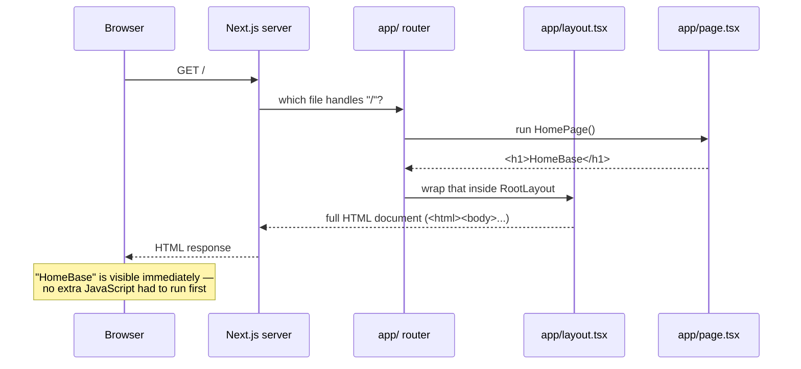

# Architecture (as of v0.0.1)

This describes how HomeBase is put together today. At this stage the app is
a single page that says "HomeBase" — there's no database, no login, no
styling. This doc will grow as those pieces are added; see the "Not yet
built" section below for what's intentionally missing right now.

## What happens when a browser requests "/"

In words: the browser asks for the homepage, the Next.js server figures out
which file is responsible for that URL, runs it, wraps the result in the
shared page shell, and sends back a finished HTML page. Nothing happens on
the browser side to produce the content — it just displays what it was
given.

## The pieces

| Piece | What it does | Why it exists |
|---|---|---|
| **Next.js** | A framework built on top of React. It provides the server that listens for requests, decides which code should run for each URL, and turns the result into HTML. | Without it, we'd have to write our own server, our own routing, and our own way of turning React components into web pages. Next.js does all of that out of the box. |
| **React** | A library for describing UI as components — functions that return markup (like `<h1>HomeBase</h1>`). Next.js uses React as its templating engine. | Lets us build the page out of small, reusable, describable pieces instead of hand-writing HTML strings. |
| **`app/` routing** | Next.js's convention: the folder structure inside `app/` *is* the URL structure. A folder named `app/settings/` with a `page.tsx` inside would become the `/settings` page. Right now there's only `app/page.tsx`, so there's only one route: `/`. | Removes the need to manually configure routes — you add a folder, you get a URL. |
| **`layout.tsx`** | The shared wrapper every page renders inside. It owns the outer `<html>` and `<body>` tags, which Next.js requires exactly one of at the top level. | Any markup that should appear on *every* page (later: a header, a nav bar) goes here once, instead of being repeated on every page. |
| **`page.tsx`** | The content for one specific URL. `app/page.tsx` is the homepage because it sits directly inside `app/`. | This is where a page's actual content lives — separate from the shared shell in `layout.tsx`. |
| **TypeScript** | JavaScript with type-checking added. It catches certain mistakes (like passing the wrong kind of value to a function) while writing code, before ever running it. | Catches a class of bugs early, and makes it easier to know what a piece of code expects, especially useful when relearning a codebase after time away. |

## Server-rendered, and what that means

`app/page.tsx` runs on the server, not in the browser. By default, every
page in the App Router is a **Server Component**: Next.js runs its code
once on the server for each request, produces the resulting HTML, and sends
that finished HTML to the browser. The browser doesn't need to download or
run any JavaScript just to show "HomeBase" — it only has to display the
HTML it was handed.

This matters for two reasons: it's faster (nothing to compute in the
browser first) and it's simpler to reason about (the same code always
produces the same output, since it always runs in the same place — the
server — instead of behaving differently across browsers). Later, if a
page needs interactivity (a button that reacts to clicks, for example),
that specific piece would be marked a "Client Component" and would run in
the browser too — but nothing in this app does that yet.

## Not yet built

These are deliberately absent at this stage, not overlooked:

- **No `components/` folder** — there's only one page, so there's nothing
  yet to share between pages.
- **No data fetching** — the page doesn't read from a database or any
  external API; "HomeBase" is a hardcoded string.
- **No state** — nothing on the page changes after it loads; there's no
  interactivity to track.
- **No styling** — plain, unstyled HTML.
- **No auth** — there's no concept of a logged-in user yet; anyone who
  loads the page sees the same thing.

Each of these will get its own entry in this document (and likely its own
diagram) once it exists.
