# Architecture (as of v0.0.1)

This describes how HomeBase is put together today. At this stage the app is
a signed-in homepage plus sign-up and sign-in pages — there's a database
and accounts now, but no permissions yet and no styling. This doc will grow as those pieces are added; see the "Not yet
built" section below for what's intentionally missing right now.

## What happens when a browser requests "/"

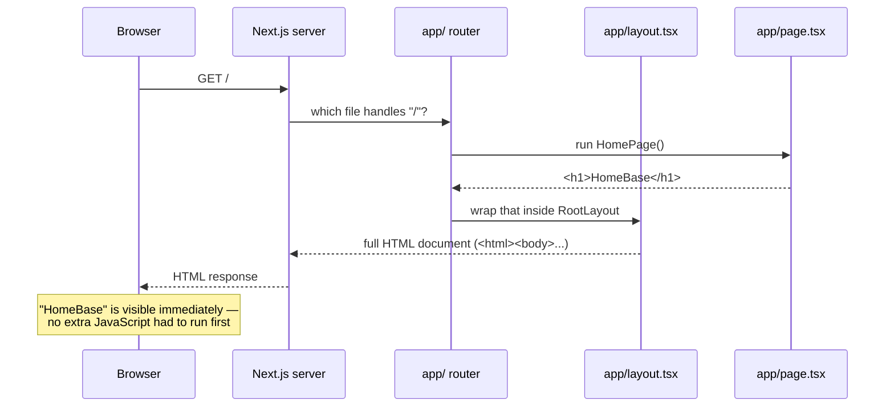
```mermaid
sequenceDiagram
    participant Browser
    participant Server as Next.js server
    participant Router as app/ router
    participant Layout as app/layout.tsx
    participant Page as app/page.tsx

    Browser->>Server: GET /
    Server->>Router: which file handles "/"?
    Router->>Page: run HomePage()
    Page-->>Router: <h1>HomeBase</h1>
    Router->>Layout: wrap that inside RootLayout
    Layout-->>Server: full HTML document (<html><body>...)
    Server-->>Browser: HTML response
    Note over Browser: "HomeBase" is visible immediately —<br/>no extra JavaScript had to run first
```

In words: the browser asks for the homepage, the Next.js server figures out
which file is responsible for that URL, runs it, wraps the result in the
shared page shell, and sends back a finished HTML page. Nothing happens on
the browser side to produce the content — it just displays what it was
given.

## The pieces

| Piece | What it does | Why it exists |
|---|---|---|
| **Next.js** | A framework built on top of React. It provides the server that listens for requests, decides which code should run for each URL, and turns the result into HTML. | Without it, we'd have to write our own server, our own routing, and our own way of turning React components into web pages. Next.js does all of that out of the box. |
| **React** | A library for describing UI as components — functions that return markup (like `<h1>HomeBase</h1>`). Next.js uses React as its templating engine. | Lets us build the page out of small, reusable, describable pieces instead of hand-writing HTML strings. |
| **`app/` routing** | Next.js's convention: the folder structure inside `app/` *is* the URL structure. A folder named `app/settings/` with a `page.tsx` inside would become the `/settings` page. Right now there's only `app/page.tsx`, so there's only one route: `/`. | Removes the need to manually configure routes — you add a folder, you get a URL. |
| **`layout.tsx`** | The shared wrapper every page renders inside. It owns the outer `<html>` and `<body>` tags, which Next.js requires exactly one of at the top level. | Any markup that should appear on *every* page (later: a header, a nav bar) goes here once, instead of being repeated on every page. |
| **`page.tsx`** | The content for one specific URL. `app/page.tsx` is the homepage because it sits directly inside `app/`. | This is where a page's actual content lives — separate from the shared shell in `layout.tsx`. |
| **TypeScript** | JavaScript with type-checking added. It catches certain mistakes (like passing the wrong kind of value to a function) while writing code, before ever running it. | Catches a class of bugs early, and makes it easier to know what a piece of code expects, especially useful when relearning a codebase after time away. |

## Server-rendered, and what that means

`app/page.tsx` runs on the server, not in the browser. By default, every
page in the App Router is a **Server Component**: Next.js runs its code
once on the server for each request, produces the resulting HTML, and sends
that finished HTML to the browser. The browser doesn't need to download or
run any JavaScript just to show "HomeBase" — it only has to display the
HTML it was handed.

This matters for two reasons: it's faster (nothing to compute in the
browser first) and it's simpler to reason about (the same code always
produces the same output, since it always runs in the same place — the
server — instead of behaving differently across browsers). Later, if a
page needs interactivity (a button that reacts to clicks, for example),
that specific piece would be marked a "Client Component" and would run in
the browser too — but nothing in this app does that yet.

## Deployment

Two external services are now part of getting code live: **GitHub Actions**
(covered in [lesson 02](lessons/02-github-actions.md)) runs checks on every
pull request, and **Vercel** builds and hosts the app.

Vercel builds automatically on every merge to `main`, but does not
automatically point the production domain at that build — that's a
deliberate setting ("Auto-assign Custom Production Domains" is disabled).
A separate GitHub Actions workflow
([`.github/workflows/promote.yml`](../.github/workflows/promote.yml)) only
assigns the production domain when a version tag (`v*`) is pushed. It first
refuses a tag that doesn't match `package.json`, isn't higher than every
earlier tag, or is a patch whose minor release hasn't shipped. Then it works by
finding the build made from the exact commit the tag points to and running
the Vercel CLI's `promote` command on it — not just whatever Vercel
considers the latest build, since `main` may have moved on since the tag
was cut. If no build exists for that commit, the workflow fails loudly and
leaves production untouched. See [lesson 03](lessons/03-tags-releases-promote.md)
for the full build-vs-promote explanation and a diagram of that flow.

In short: merging to `main` builds; pushing a tag is what actually goes
live. The production address is `home-base-peach.vercel.app`.

Vercel also gives the project an address of its own,
`home-base-home-base12.vercel.app`, which does follow the newest build.
It is not production, and nothing should be judged by it — mistaking the
two is a live trap, described in
[lesson 03](lessons/03-tags-releases-promote.md).

Database structure follows the same path with one more workflow:
[`.github/workflows/migrate.yml`](../.github/workflows/migrate.yml)
applies any new file in `supabase/migrations/` to the hosted Supabase
project as soon as it lands on `main`, so the schema is never behind the
code that needs it. See [lesson 07](lessons/07-supabase-auth-and-migrations.md).

The homepage itself reads two of Vercel's build-time environment
variables (`VERCEL_GIT_COMMIT_REF`, `VERCEL_GIT_COMMIT_SHA`) and displays
them as small text, so it's possible to confirm which commit is actually
live by looking at the page itself. See
[lesson 04](lessons/04-build-time-env-vars.md) for how that works and a
limitation worth knowing (it shows the branch that built the code, not
the release tag).

## Error tracking

A third external service, **Sentry**, is now wired in: errors from both
the browser and the server are reported to it automatically, via
`instrumentation-client.ts`, `sentry.server.config.ts`,
`sentry.edge.config.ts`, and `instrumentation.ts` (which connects Next.js's
own error hook to Sentry). Configuration is a single environment variable,
`NEXT_PUBLIC_SENTRY_DSN`. See
[lesson 05](lessons/05-sentry-error-tracking.md) for what Sentry is, what a
DSN is, and what actually shows up when an error fires.

## Data and sign-up

A fourth external service, **Supabase**, now holds the data and the
accounts: a Postgres database plus an Auth service, reached through
`@supabase/supabase-js` and `@supabase/ssr`
([`lib/supabase/server.ts`](../lib/supabase/server.ts)). Database
structure lives in `supabase/migrations/` and is applied with the Supabase
CLI (`npx supabase db push`), never by hand in the dashboard. See
[lesson 07](lessons/07-supabase-auth-and-migrations.md) for what Supabase
is, how migrations work, and the reasoning below in full.

Four tables: `households`; `roles` (Admin and Member as rows, each with a
`max_holders` limit — 2 for Admin); `role_permissions`, the keys each
role holds (`use_modules`, `manage_members`, `manage_roles`); and
`household_members`, which links a user to the household with a role.

Row-level security policies decide who may do what, and every policy asks
one of two `security definer` helpers — `is_member()` or
`has_permission('…')` — never a role's name: any member reads all
household data; changing memberships needs `manage_members`; changing
roles or their permissions needs `manage_roles`. A trigger refuses a
membership that would push a role past its `max_holders`. App code uses
the same `has_permission` over RPC
([`lib/auth/permissions.ts`](../lib/auth/permissions.ts)) to decide what
to show. See [lesson 09](lessons/09-permissions-as-data-and-rls.md). The
one thing a signed-out visitor can ask is `household_exists()`, which
returns only true or false.

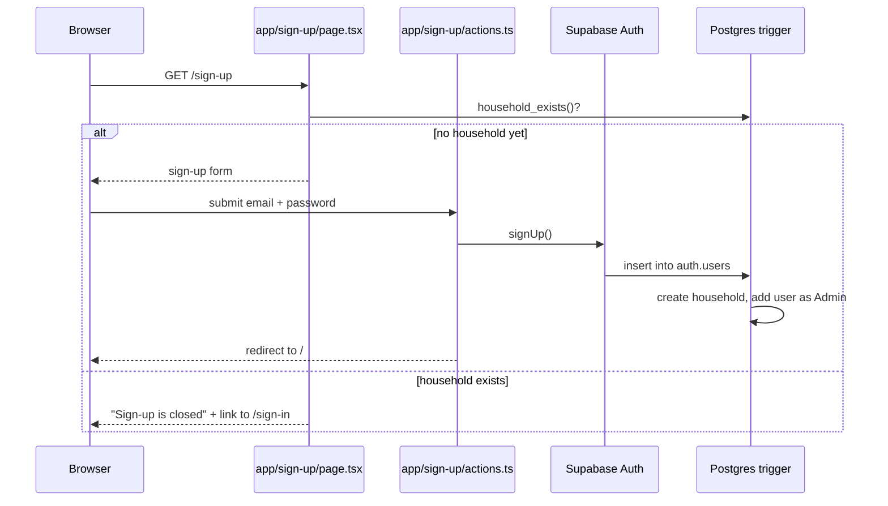
```mermaid
sequenceDiagram
    participant Browser
    participant Page as app/sign-up/page.tsx
    participant Action as app/sign-up/actions.ts
    participant Auth as Supabase Auth
    participant DB as Postgres trigger

    Browser->>Page: GET /sign-up
    Page->>DB: household_exists()?
    alt no household yet
        Page-->>Browser: sign-up form
        Browser->>Action: submit email + password
        Action->>Auth: signUp()
        Auth->>DB: insert into auth.users
        DB->>DB: create household, add user as Admin
        Action-->>Browser: redirect to /
    else household exists
        Page-->>Browser: "Sign-up is closed" + link to /sign-in
    end
```

The rule "only the first sign-up creates a household" is enforced by that
trigger inside the database, not by the page. The page hides the form as a
courtesy once a household exists, but a request sent straight to Supabase's
sign-up endpoint hits the same trigger and is refused just the same.

After that first sign-up, accounts are created by an admin from the
console (`app/admin/`). The Server Action first writes the email into a
`member_invitations` table (only `manage_members` holders may, by RLS),
then uses the server-only `SUPABASE_SECRET_KEY`
([`lib/supabase/admin.ts`](../lib/supabase/admin.ts)) to create the user
with a temporary password. The trigger admits the new user only because
that invitation exists, grants the invited role (Member by default), and
deletes the invitation. Invitations expire ten minutes after they are
written and the trigger ignores expired ones, so a row left behind by a
create that died mid-way cannot admit anyone later; the admin action
clears expired rows before writing a new one.
A `must_set_password` flag in `app_metadata` —
which only the secret key can write — is read by the proxy from the login
token to send the person to `/set-password` before anything else. No
email is sent. See [lesson 11](lessons/11-creating-accounts-for-others.md).

The console then lists every member — name and email come from the
private `auth.users` table through `household_members_overview()`, a
`security definer` function that returns rows only to `manage_members`
holders — with a role dropdown fed from the `roles` table and a
password-reset form. Role changes are plain updates to
`household_members`, guarded by RLS and by two triggers reading the role's
`max_holders` and `min_holders` (Admin: at most 2, at least 1), so the
only admin cannot demote themselves. A floor guards a *living* household:
it also refuses to let the last admin's account be deleted, which would
leave the other members with nobody able to manage them, but it stands
aside when the household row itself is deleted and its memberships
cascade away. Tearing a household down therefore means deleting the
household first, then the accounts. A reset sets a temporary password and
`must_set_password` through the secret key; Supabase signs the member out
everywhere, and their next sign-in lands on `/set-password`. See
[lesson 12](lessons/12-the-member-ledger.md).

Each membership also carries a `notifications_enabled` flag, off by
default, which an admin turns on or off from the roster. Row-level
security decides which *rows* you may read; this flag needed the
column-level equivalent, so the table-wide `select` grant on
`household_members` was withdrawn from `authenticated` and re-granted
column by column, leaving this one out. Members therefore still read
every membership row but cannot see, or ask for, who has notifications
on — not even with `select=*`, which now fails rather than quietly
omitting it. `anon` had its grant withdrawn and nothing handed back, so a
signed-out visitor can read no column of this table at all; the policies
were already `to authenticated`, and this is the second layer. The roster function is `security definer`, so it
runs as the table's owner and can still return the flag to
`manage_members` holders.

That makes the roster function the only way to read the flag, and it
requires `manage_members` — which a background job, having no signed-in
user, will never hold. So the sender in REQ-21 needs its own route to it,
either as `service_role` or through a second `security definer` function
written for a caller that is nobody. Nothing sends notifications yet.

## Emailed links: changing an email, and a forgotten password

Everything above creates accounts with no email at all. Two things do need
one, and both use the same piece (REQ-158, #80). Supabase sends the email,
through the SMTP account set in its dashboard (Gmail, for now: see
[lesson 35](lessons/35-emailed-links.md)). The app sends nothing itself.
Each email's template points at `{{ .RedirectTo }}`, which the app fills in
from the address the person is using, with a one-time `token_hash` and a
`type`. The link lands on `app/auth/confirm/route.ts`, which is left out of
the sign-in proxy's matcher because the person may be signed out. It
accepts only `recovery` and `email_change`, calls `verifyOtp`, and goes to
one of three fixed places: `/set-password`, `/`, or `/sign-in?link=invalid`.
No address comes from the link.

- **Forgot password** (`/forgot-password`, public): asks Supabase to email
  a recovery link, and answers the same way for any address. Following it
  signs the person in, sets `must_set_password` through the secret key,
  takes a fresh token that carries it, and lands on the existing
  `/set-password` step.
- **Change your own email** (Profile): `updateUser({ email })`. With
  Supabase's "Secure email change" off, only the new address should be
  emailed, and the change should take effect once it confirms (unproven
  until a real send).
- **Admin changes a member's email** (admin console, People card). For
  someone who has signed in before, the server briefly acts as them to ask
  Supabase for the same confirmation: `generateLink` (a one-time link that
  should send nothing: unproven) → `verifyOtp` on a client that keeps no session
  (`lib/supabase/ephemeral.ts`) → `updateUser` → sign that session out.
  For someone who never has, the address changes at once, their temporary
  password is replaced with a random one, `must_set_password` is set, and a
  recovery link goes to the new address: the first-time sign-in. Duplicates
  are refused against the household's own member list first.

Confirming an email change then ends every session on the account
(`signOut({ scope: "global" })`, which includes the one the link just
made), clears that person's `push_subscriptions` and this browser's
`homebase-device` note, and lands on `/sign-in?link=email-changed`. The
address is how they sign in, so it takes a fresh sign-in, and a session left
open elsewhere can't outlive the change for long: other devices drop within
up to an access-token lifetime (about an hour by default), since the proxy
checks the token locally. Unproven until a real run.

Same account throughout, so data, role, notification switch and module
settings never move.

## Sign-in and sessions

Signing in (`app/sign-in/`) calls Supabase Auth with the email and
password; on success Supabase issues an access token and a refresh token,
which `@supabase/ssr` stores in cookies. From then on, one file runs
before every page:
[`proxy.ts`](../proxy.ts) — Next.js's request interceptor (formerly
`middleware.ts`). It refreshes the session if needed and applies the
routing rule in [`lib/auth/routing.ts`](../lib/auth/routing.ts): signed
out → `/sign-in` (except `/sign-in` and `/sign-up` themselves); signed in
→ everything else. See [lesson 08](lessons/08-sessions-and-the-proxy.md)
for what a session is, why the check verifies the token's signature rather
than trusting the cookie, and the devices-are-independent rules.

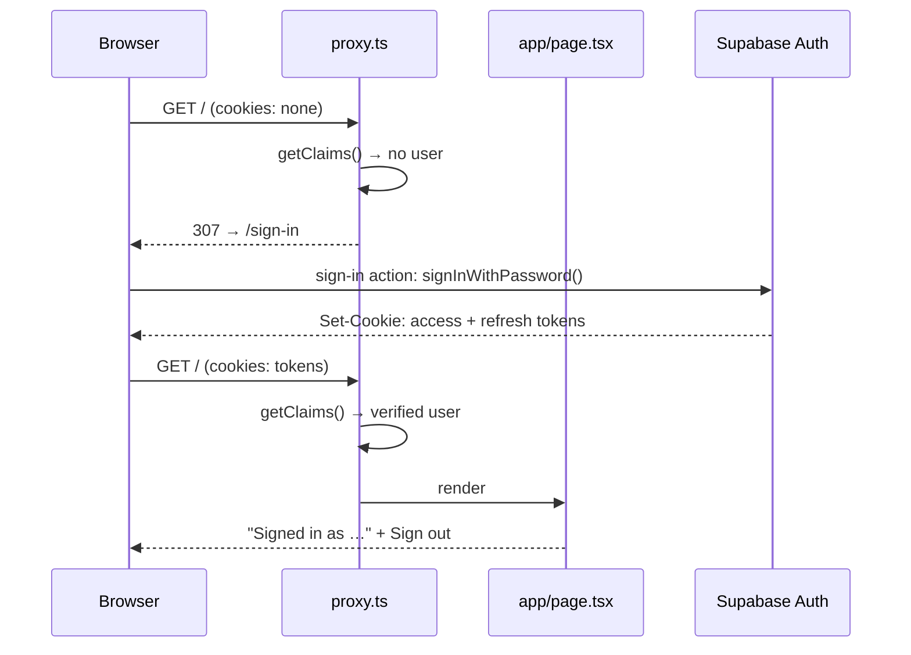
```mermaid
sequenceDiagram
    participant Browser
    participant Proxy as proxy.ts
    participant Page as app/page.tsx
    participant Auth as Supabase Auth

    Browser->>Proxy: GET / (cookies: none)
    Proxy->>Proxy: getClaims() → no user
    Proxy-->>Browser: 307 → /sign-in

    Browser->>Auth: sign-in action: signInWithPassword()
    Auth-->>Browser: Set-Cookie: access + refresh tokens
    Browser->>Proxy: GET / (cookies: tokens)
    Proxy->>Proxy: getClaims() → verified user
    Proxy->>Page: render
    Page-->>Browser: "Signed in as …" + Sign out
```

Sign-out (`app/sign-out/actions.ts`) ends this device's session only and
sends the visitor back to `/sign-in`.

## Admin access

A role decides what someone *may* do. Admins reach the console at
[`app/admin/`](../app/admin/page.tsx) from the sidebar on a desktop, and
on a phone from the account pill's menu on Home
([`components/account-menu.tsx`](../components/account-menu.tsx)). Both
are shown only to holders of `manage_members`. The console checks the
same permission itself, so hiding the way in is a courtesy and the
page's check is the lock: a member who types `/admin` is sent home. Both ask for the
permission, never a role's name.

v0.1 also had an admin *mode*: admins saw the member view until they
switched, and a session cookie remembered the switch. The v0.2 design
dropped it (a Notion decision of 2026-09-21), and with it the switch, the
cookie and its code. See [lesson 10](lessons/10-modes-are-not-roles.md).

## Installing on iPhone

[`app/manifest.ts`](../app/manifest.ts) produces the web app manifest,
served at `/manifest.webmanifest` and linked from every page: the name
HomeBase, `start_url: "/"`, `display: "standalone"` (full screen, no
address bar) and two icons in `public/` (192 and 512 pixels).
[`app/layout.tsx`](../app/layout.tsx)'s `metadata` adds what iOS reads
from each page's head: a 180 pixel `apple-touch-icon` and the home-screen
title. Full screen comes from the manifest's `display`.

Every icon file is made from the design's icon by
[`scripts/export-icons.sh`](../scripts/export-icons.sh). The home-screen
PNGs are exported square, because iPhones round an app icon's corners
themselves. The browser tab gets the design's `icon.svg` as drawn, with a
`favicon.ico` for browsers that can't show SVG. `metadata` lists every
icon link. Once a layout lists icons itself, Next.js stops linking icon
files kept in `app/`, so they all live in `public/`.

Phones fetch the manifest without cookies, so the proxy's `matcher` skips
it, next to `favicon.ico`. Otherwise the proxy would find no sign-in and
answer with the sign-in page. The icon files end in `.png`, `.svg` or
`.ico`, which the matcher already skipped. None of them holds anything
private.

Staying signed in across opens of the installed app rests on the session
cookies' 400-day lifetime, which `@supabase/ssr` sets and renews on every
refresh. Tests pin it where our code writes those cookies: at sign-in,
through [`lib/supabase/server.ts`](../lib/supabase/server.ts), and at
renewal, in the proxy. See
[lesson 13](lessons/13-installing-on-the-iphone.md).

## Turning notifications on

The account menu's Settings sheet carries a small browser-side control,
[`app/notifications/enable-notifications.tsx`](../app/notifications/enable-notifications.tsx).
The control shows only in that sheet, but Home runs the same check on
every load, out of sight (`KeepThisDevice`).
In a normal browser tab it explains that notifications need the
home-screen install. In the installed app it registers the service
worker, [`public/sw.js`](../public/sw.js), which the phone keeps running
in the background to receive and show notifications. It then offers
**Enable notifications**, which asks the phone's permission as the first
thing the tap does.

On a yes, the browser's `pushManager.subscribe()` returns a subscription
from the phone's push service (Apple's, for an iPhone). The subscription
is an address (`endpoint`) plus two keys that let a sender encrypt for
that one device. It's made against the app's public push key,
`NEXT_PUBLIC_VAPID_PUBLIC_KEY`, which the server page hands to the
control. Its private half, `VAPID_PRIVATE_KEY`, waits in Vercel for the
sender in REQ-21. The Server Action
[`app/notifications/actions.ts`](../app/notifications/actions.ts) saves
the subscription to a new table:

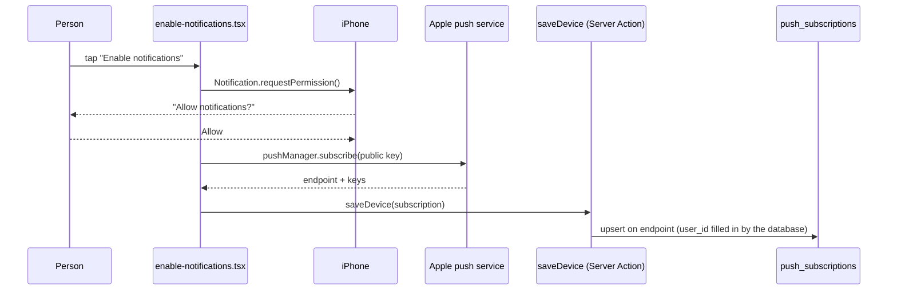
```mermaid
sequenceDiagram
    participant Person
    participant Control as enable-notifications.tsx
    participant Phone as iPhone
    participant Apple as Apple push service
    participant Action as saveDevice (Server Action)
    participant DB as push_subscriptions

    Person->>Control: tap "Enable notifications"
    Control->>Phone: Notification.requestPermission()
    Phone-->>Person: "Allow notifications?"
    Person-->>Phone: Allow
    Control->>Apple: pushManager.subscribe(public key)
    Apple-->>Control: endpoint + keys
    Control->>Action: saveDevice(subscription)
    Action->>DB: upsert on endpoint (user_id filled in by the database)
```

Saving also writes the device's address into a `homebase-device` cookie
(`httpOnly`), which is how sign-out knows which device this browser is.
[`app/sign-out/sign-out-form.tsx`](../app/sign-out/sign-out-form.tsx)
first asks the push service to forget this device, then
[`app/sign-out/actions.ts`](../app/sign-out/actions.ts) removes that one
row and clears the cookie before ending the session — in that order,
since the delete needs the session. A failed clean-up is logged and
sign-out continues. Their other devices keep their notifications.

Two guards keep this from enrolling the wrong person: the control only
confirms an existing subscription when its address matches that cookie,
so anyone else must tap Enable; and signing in
([`app/sign-in/actions.ts`](../app/sign-in/actions.ts)) clears the
cookie left by whoever was here before. If an address is still held by
someone who never signed out, tapping Enable unsubscribes, signs up
again for a fresh address and saves that.

`push_subscriptions` holds one row per device (`endpoint` is unique,
`user_id` isn't), so a person can have several. `user_id` defaults to
`auth.uid()` and references `household_members`, so leaving the household
removes the devices. Row-level security lets each member see, add,
change and remove only their own rows, and every policy also asks
`is_member()`. `anon` has no grants at all. A check constraint accepts
only the push services' own addresses (Apple, Google, Mozilla,
Microsoft), because the sender will call every address stored here.
Like the notifications flag, nobody but the device's owner can read
these rows through the API, so REQ-21's sender will need `service_role`.

The service worker skips the proxy, like the manifest does. The phone
re-checks it in the background, and it refuses a service worker that
answers with a redirect, which is what a lapsed sign-in would otherwise
produce. See [lesson 14](lessons/14-turning-notifications-on.md).

An open page also asks `/api/version` which commit the server is
running (REQ-128). That answer is only the commit, and it sits behind
sign-in like the pages. When it differs from the commit the page was
built with, the page offers a refresh. Pull to refresh (REQ-127) asks
the service worker to update, then reloads. See
[lesson 13](lessons/13-installing-on-the-iphone.md).

The admin console's "This app" card (REQ-123) says which build **this
installed copy** is running: release tag, short commit linked to GitHub,
environment and build time. `next.config.ts` writes the version, commit,
branch, Vercel environment and build time into the app's own code when it
is built (`NEXT_PUBLIC_BUILD_*`), so a copy loaded last week still says
last week's build after a newer one is deployed; a value read on the
server per request would say the newest. A build can't know its release
tag, because a release is tagged after its commit has been built, so the
card asks GitHub's public API from the browser whether the tag named by
the build's version points at the build's commit
(`lib/build-info.ts`); when GitHub can't be reached it says "Couldn't
check", never "untagged".

## Sending the test notification

[`lib/notifications/send.ts`](../lib/notifications/send.ts) is the only
place anything is sent. It reads who is switched on
(`household_members.notifications_enabled`) and their devices
(`push_subscriptions`) with the **secret key**, because both are private
to their owner and a scheduled job has nobody signed in. Turning
notifications on by hand on a phone (`saveDevice`, not its quiet sign-up)
also sets that person's switch on, with the same key, so the phone and the
admin console agree. It signs and
encrypts each message with `web-push` — a new dependency, and the
standard one for this — using `NEXT_PUBLIC_VAPID_PUBLIC_KEY` and
`VAPID_PRIVATE_KEY` from Vercel, with the app's own address as the
contact the push services require (written as `https` even on localhost,
which they insist on). A device whose push service answers `404` or
`410 Gone` has its row removed.

Two things start a send:

- **The hourly schedule.** Vercel's free plan allows only a daily job, so
  the clock lives in the database: `pg_cron` and `pg_net` (added by
  [`20260919190000_hourly_test_notification.sql`](../supabase/migrations/20260919190000_hourly_test_notification.sql))
  call the app. The address and a shared secret live in Supabase's vault
  (`notify_url`, `notify_secret`), never in git; until both exist a job
  does nothing. The route has no session to check — the database isn't a
  person — so it compares the secret against `NOTIFY_SECRET` in constant
  time ([`lib/notifications/schedule-auth.ts`](../lib/notifications/schedule-auth.ts)),
  and the proxy's matcher skips just that path (and the receipt address below). Vercel's own Deployment
  Protection is off for this reason and one bigger one: it would have
  required every visitor, household members included, to hold a Vercel
  account. HomeBase's invite-only sign-in is the real gate. Until
  2026-09-24 a job sent an hourly test notification; it was stopped, and a
  separate job, `finance-reminders`, now uses the same clock and secret
  (see below), reading only the origin of `notify_url`.
- **"Send test now"** in the admin console
  ([`app/admin/send-test-form.tsx`](../app/admin/send-test-form.tsx)),
  behind `manage_members` like everything else there, which calls the
  same sender.

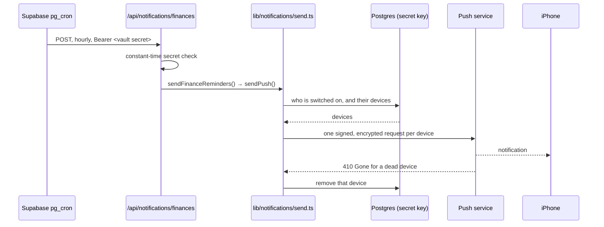
```mermaid
sequenceDiagram
    participant Cron as Supabase pg_cron
    participant Route as /api/notifications/finances
    participant Send as lib/notifications/send.ts
    participant DB as Postgres (secret key)
    participant Apple as Push service
    participant Phone as iPhone

    Cron->>Route: POST, hourly, Bearer <vault secret>
    Route->>Route: constant-time secret check
    Route->>Send: sendFinanceReminders() → sendPush()
    Send->>DB: who is switched on, and their devices
    DB-->>Send: devices
    Send->>Apple: one signed, encrypted request per device
    Apple-->>Phone: notification
    Apple-->>Send: 410 Gone for a dead device
    Send->>DB: remove that device
```

See [lesson 15](lessons/15-sending-a-notification.md).

## The notification log

[`supabase/migrations/20260920060000_notification_log.sql`](../supabase/migrations/20260920060000_notification_log.sql)
adds `notification_log`: one row per notification per device, holding when
it was sent, what triggered it, whose it was, which device, and when (or
whether) it arrived and was tapped.

Only the sender and the receipt address write to it, both with the
**secret key**. There is no insert, update or delete policy at all, so
nobody signed in can write to it directly — and what is stored is a
**hash** of each receipt token rather than the token, so an admin reading
the log cannot quote one back to record a delivery that never happened
either. Admins can
read it, which is the first time an admin can see anything about another
member's notifications — REQ-16 and REQ-20 deliberately hid switches and
devices even from admins. What is exposed is narrower: times, and a
one-way **fingerprint** of the device rather than its push address, which
is the thing that would let anyone send to that phone.

Delivery is reported by the phone itself, because nothing else knows.
[`public/sw.js`](../public/sw.js) calls
[`app/api/notifications/receipt/route.ts`](../app/api/notifications/receipt/route.ts)
when a notification shows and again when it is tapped. That call carries
no session — a notification can arrive for someone signed out — so it
proves itself with a **receipt token**: a random secret placed inside
that one encrypted message, so only the device it was sent to can quote
it. The address hashes what arrives and matches that against the log. It
answers `204` to everything, so it cannot be used to test guesses, and
the proxy's matcher skips it for the same reason it skips the Finances
reminders' address. It is open to the internet and unthrottled; the blast radius is
one row, but the request volume is not bounded.

The log rows are written **before** the notifications are sent. A push
can be delivered and reported back in well under a second, and a receipt
that arrives before its row exists would be lost.

"Missing after 5 minutes" is worked out when the log is read
([`lib/notifications/log.ts`](../lib/notifications/log.ts)), not stored,
so the rule lives in one place and can be tightened without a migration.
A daily `pg_cron` job deletes entries older than 30 days.

The console reads the whole 7-day window and shows it 25 rows to a page
(`?page=N`, REQ-126), so the summary line always covers the window, not
the page. Times are drawn in UTC on the server and turned into the
viewer's own time zone once the page is in the browser
(`app/admin/local-time.tsx`). Beside each person in the Notifications
card the console says how many devices they have registered: an empty
`push_subscriptions` table explains an empty "arrived" column.

**Testing and managing devices (REQ-159, REQ-160).** Each member row has
its own "Send test", enabled only while that person's switch is on; it
calls `sendPush` with `to: [thatPerson]`, so the same switch rule and the
same log rows apply. Under each member the console lists their devices,
and Profile → Settings lists your own ("My devices"); both use
`lib/notifications/devices.ts`, which reads `push_subscriptions` and the
log with the secret key and hands the screen only an id, a readable name
from the saved user-agent ("iPhone, Safari"), when it was added, and when
the log last shows a delivery to it (the log keeps 30 days). The push
address never reaches the browser; a device is named by its row id. Each
list can remove a device (the admin's any member's, Settings' only your
own, checked first as you under row-level security), and Settings can send
one device a test (`sendPush` with `onlyEndpoint`).

Removing deletes the row, which stops the sender at once. But a phone that
still holds its permission and its `homebase-device` note re-saves itself
quietly when Home opens (`KeepThisDevice`). So removal also writes a
SHA-256 of the address to `removed_devices` (secret key only, no policies,
cascades away with the person), and the quiet path (`saveDevice(…, {
quiet: true })`) stays out when the mark exists. Turning notifications on
by hand is a deliberate tap and clears the mark.

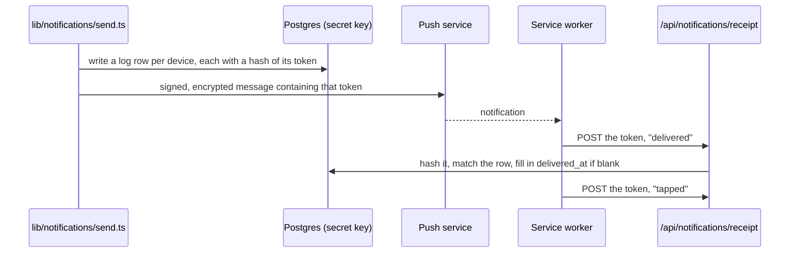
```mermaid
sequenceDiagram
    participant Send as lib/notifications/send.ts
    participant DB as Postgres (secret key)
    participant Apple as Push service
    participant SW as Service worker
    participant Receipt as /api/notifications/receipt

    Send->>DB: write a log row per device, each with a hash of its token
    Send->>Apple: signed, encrypted message containing that token
    Apple-->>SW: notification
    SW->>Receipt: POST the token, "delivered"
    Receipt->>DB: hash it, match the row, fill in delivered_at if blank
    SW->>Receipt: POST the token, "tapped"
```

See [lesson 16](lessons/16-the-notification-log.md).

## Look and feel

The design lives in [`docs/design/`](design/): the rules in `DESIGN.md`,
reference mockups, the app icon, and
[`tokens.css`](design/tokens.css), which writes every colour, font,
corner size and spacing value down once as a named CSS variable (a
*token*). The root layout ([`app/layout.tsx`](../app/layout.tsx)) loads
that file straight from the design folder, so the app and the design
read the same file and can't drift apart. It then loads
[`app/globals.css`](../app/globals.css), the base every page starts from:
warm-white ground, ink text, the body font on everything including form
controls, and the display font at weight 800 on headings.

Styles name tokens (`var(--color-muted)`), never raw values.
[`app/no-raw-design-values.test.ts`](../app/no-raw-design-values.test.ts)
reads every stylesheet and component and fails on a raw colour, font or
corner size, and on a token name that doesn't exist. A browser raises no
error for a misspelt token; it quietly resets that colour or size to its
default.

The fonts come through `next/font` ([`app/fonts.ts`](../app/fonts.ts)),
which is part of Next.js rather than a new dependency. It adds a new
outside service, but only at build time: while the app is built (on
Vercel, and in CI) it downloads Bricolage Grotesque and Plus Jakarta Sans
from Google Fonts, and the app then serves them from its own address.
Opening HomeBase never contacts Google. If Google Fonts can't be reached,
the build fails rather than shipping without the fonts; that was checked
by building through a dead proxy.

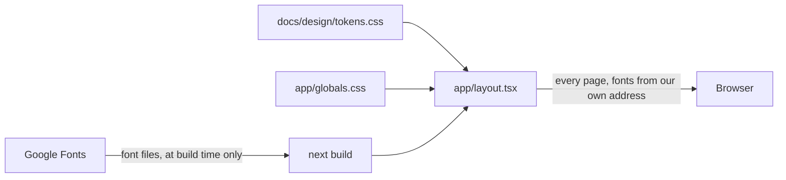
```mermaid
flowchart LR
    Google[Google Fonts] -- "font files, at build time only" --> Build[next build]
    Tokens[docs/design/tokens.css] --> Layout[app/layout.tsx]
    Base[app/globals.css] --> Layout
    Build --> Layout
    Layout -- "every page, fonts from our own address" --> Browser
```

Each font's name reaches the tokens through a CSS variable set on
`<html>`, together with a system font resized to the same proportions,
which stands in until the file arrives so text doesn't jump. See
[lesson 17](lessons/17-design-tokens-and-fonts.md).

Pieces used on more than one page live in
[`components/`](../components/), starting with the brand lockup: the
icon beside "HomeBase". Each has its own stylesheet, a **CSS Module**
(`brand-lockup.module.css`), whose class names Next.js makes unique to
that component, so one component's styles can't leak onto another's.
Forms used by a single page still live next to it.

## Phone and desktop layouts

Every signed-in page sits in one frame,
[`components/app-frame.tsx`](../components/app-frame.tsx), which holds
both layouts at once. Below 1024 px wide the stylesheets show the phone
one: the page scrolls, and a bar stays fixed at the bottom. From 1024 px
they show the desktop one: a sidebar
([`components/sidebar.tsx`](../components/sidebar.tsx)) beside the page.
The width decides alone, with no device detection, so resizing a window
switches on the spot. A stylesheet can't read a token inside `@media`, so
each states `1024px` itself, and a test holds every one of them to
`--breakpoint-desktop`.

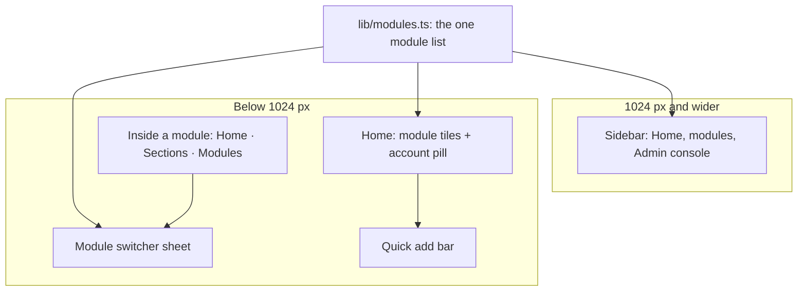
```mermaid
flowchart TB
    List[lib/modules.ts: the one module list] --> Sidebar & Tiles & Switcher
    subgraph Desktop["1024 px and wider"]
      Sidebar[Sidebar: Home, modules, Admin console]
    end
    subgraph Phone["Below 1024 px"]
      Tiles[Home: module tiles + account pill] --> QuickAdd[Quick add bar]
      Bar[Inside a module: Home · Sections · Modules] --> Switcher[Module switcher sheet]
    end
```

The modules come from one list in code,
[`lib/modules.ts`](../lib/modules.ts): name, slug, token prefix, home
page and sections. Home's tiles, the sidebar and the phone's module
switcher all draw from it, so a new module is a new entry. v0.2 lists
all six but gives only Finances a page (`/finances`, an empty shell). The
other five show without a link, per a Notion decision of 2026-09-21. A
module's colours reach its components as `--module-*` variables built
from its token prefix, and a test checks every prefix has all six
colours.

What each tile says comes from
[`lib/module-status.ts`](../lib/module-status.ts): a status line for a
phone, a headline and two facts for a desktop, and the module's action
items. A tile is loud, in its module's solid colour, if and only if the
module has an action item. No module has data yet, so that file is a
stand-in: every module is quiet and says "Coming soon", unless `?demo`
is in Home's address, which swaps in the design's invented example (a
Notion decision of 2026-09-21). Home draws tiles only for modules that
are on and that you haven't hidden (see "Module switches" below).

The action items card at the top of Home reads the same stand-in: each
item carries an urgency rank, and Home shows the three most urgent
across the modules that are on, hidden or not, so a loud tile's item is always there
unless three more urgent ones fill the card. `?demo=0` to `?demo=4` show
each state of the card, from All clear to more items than fit. The card
([`components/action-items.tsx`](../components/action-items.tsx)) is
one list that scrolls sideways and snaps to one card at a time on a
phone, and lays the cards side by side on a desktop. It runs in the
browser, to keep the "1 / 3" counter in step with the swipe.

On a phone, Home has no navigation bar: the tiles and the account pill do
that job, and Quick add stays at the bottom. Inside a module the bottom
bar is Home · Sections · Modules. Sections and Modules open **bottom
sheets** ([`components/bottom-sheet.tsx`](../components/bottom-sheet.tsx)),
built on the browser's own `<dialog>`. These are the first interactive
pieces of the frame, so they run in the browser as Client Components.
So does Home's greeting, because only the phone knows its own time of
day. `same-capabilities.test.tsx` renders the pages and checks that
every place the desktop sidebar reaches is reachable without it.

The layout meets the phone's edges with `viewport-fit=cover` and the
screen's safe-area insets, so content clears the notch and the home bar.
That part has not been checked on an iPhone. See
[lesson 18](lessons/18-one-app-two-layouts.md).

## Finances setup: the split, income and bills

The first real Finances data (REQ-50, 51, 94) is the yearly setup an
admin does in the Budget year section, `/finances/budget-year`. Four
tables, all in the one household, so none carries a household id:

| Table | One row is | Key facts |
|---|---|---|
| `splits` | a percentage set that starts in a month | `effective_from` (the 1st of that month, unique), `note` |
| `split_shares` | one person's percentage in that split | `split_id`, `user_id`, `percent` |
| `income_sources` | one person's regular pay | `name`, `owner_id`, `net_amount`, `cadence` (weekly, biweekly, monthly), `anchor_date` |
| `bills` | one recurring bill | `name`, `kind` (rent, card, other), `due_day`, `amount` (rent only: the same every month) |

A split holds until a later one starts, so the household can change the
percentages mid-year without touching the months already run: a month
uses the split in force when it opens (REQ-52). A split whose month has passed is what those
months were worked out from, so it stays as it is. Saving over it or
editing it is refused three times: by the screen, by the server action,
and by `save_split()` in the database. Removing it is refused by the
screen and the server action only — a delete rule in the database would
have to read the database server's own clock, which is the thing
lesson 20 argues against. The month now running is still open, which is
how the first split is saved. An income source is never rewritten either — changing one sets
`ended_on` on the old row and starts a new one from the same day, so
paydays already past keep their amount. A source is in force on a day
when `effective_from <= day` and (`ended_on` is null or `day <
ended_on`); both dates come from `householdToday()`, passed in, never
from the database server's own clock.

Any member reads all of them; writing needs the `manage_budget`
permission, which the migration gives to Admin. A split's percentages
must total 100:
a constraint trigger checks the sum when a transaction that saves a year
or a share commits (deleting a share, as when a person leaves, isn't
checked, so the total can then drop below 100), and
`save_split()` writes a split and all its shares in one transaction
so the check sees the whole set. It runs as the caller, so the policies
still decide who may save. `household_people()` lists each member's name
(or their email's first part) and whether they manage the budget, for
the split form, income owners, and the first-run message a member sees.

Every Finances date decision reads one clock: `householdToday()` in
`lib/finances/budget-year.ts`, set to `America/New_York` because that is
where the household is. The budget year, the month and the paydays
therefore turn over on the household's own day, not the server's.

The budget year itself is not stored, and nothing needs it any more: a
split carries its own month, so the April-to-March frame comes back only
when the March review (REQ-69) is built. Paydays are
projected the same way (`payDates` in `lib/finances/income.ts`) from one
real payday, so nothing is stored per payday.

## Finances months: monthly entry

A month exists once someone opens it in Monthly entry,
`/finances/monthly-entry` (REQ-53, 54, 55). Four more tables:

| Table | One row is | Key facts |
|---|---|---|
| `months` | an opened month | `starts_on` (the 1st, unique) |
| `month_bills` | one bill in that month, copied from `bills` when it opened | `name`, `kind`, `due_day` (copies), `amount`, `personal_answer` (none, some) |
| `personal_charges` | a charge inside a card statement that is one person's | `month_bill_id`, `owner_id`, `amount`, `note` |
| `direct_payments` | shared spend one person paid off the tracked cards ("one-time payments" on screen) | `month_id`, `payer_id`, `amount`, `note`, `paid_on` |

A month opens itself (REQ-101): a pg_cron job, `open-current-month`, runs
two minutes past every hour and calls `open_current_month()`, which opens
the month now running in New York once a split is in force and the bill
list has a bill. A person can
still open it first from Monthly entry with `open_month()`, which checks
membership and opens only the month now running (the day passed in from
`householdToday()`). Both go through `create_month()`, which no one signed
in can call; a second opener finds the month there and copies nothing
twice. Opening copies the bill list in (rent arrives already
entered, with its amount from the bill), so a bill changed or
removed later reaches only months opened after that (REQ-94). While the
month now running is open, the Budget year form asks whether it takes a
change too: `save_bill()` adds or updates its copy (a change to or from
a card clears that bill's entry; a rent amount becomes the month's figure), and `remove_bill()` sets a not-yet-entered
copy to $0 rather than deleting it. Both check `manage_budget`
themselves, since members can't write a month bill's name or type. Entering
is shared: any member with `use_modules` enters amounts and adds or
removes charges and payments, and everyone reads them. A member may
change only a month bill's amount and answer, not its copied name, kind
or due day (column-level grants). A card statement can't hold an amount
without an answer (a check constraint); `enter_bill()` clears the
charges when the answer goes back to "none"; and a trigger refuses
charges that come to more than the statement.

The money is worked out in code, not stored: `monthTotals()` in
`lib/finances/month.ts` adds the entered bills, takes the personal
charges out and adds the direct payments to get the shared base, then
gives each person their percentage of it, plus their own charges.

## Finances months: payments and who owes what

A payment is money one person sent to one of the month's bills,
logged on `/finances/log-payment` (REQ-57). One more table:

| Table | One row is | Key facts |
|---|---|---|
| `payments` | money one person paid toward one month bill | `month_bill_id`, `payer_id`, `amount`, `paid_on` |

Logging is shared like entering: any member with `use_modules` logs,
changes or deletes a payment for either person. A payment carries the
day it was paid (`paid_on`, today unless changed), and there is no
ceiling: a payment may come to more than its bill, and `monthTotals()`
reads the surplus as a credit (Vin, 2026-09-29; a trigger that refused
it was dropped in `20261003100000`). A bill not entered still can't be
paid toward, which the page checks.

`monthTotals()` then gives each person their obligation, what they paid
(payments toward bills plus any one-time payment they fronted) and what
is outstanding, and each bill its paid and left (REQ-56, 58). Each share
is rounded to the cent, and the last person takes the cent the rounding
left over, so the obligations always add up to the bills plus one-time
payments exactly. Finances home shows the result for the month picked
(REQ-92): a card per person, the bills with paid of total, and the
workings folded under the cards. The month runs on the split that had
started by its 1st, until it closes.

## Finances months: closing, income and the verdict

A month closes like a paper ledger being signed off (REQ-59, 52): what
it was split by and what was still owed are written onto it, and then
nothing in it changes.

| Table / column | One row is | Key facts |
|---|---|---|
| `months.closed_at`, `closed_by`, `closed_automatically`, `split_from` | when it closed, which admin, whether the nightly job did it, the month its split started | set only by `close_month()` |
| `month_people` | one person on a closed month | `percent` at the time, `outstanding` when it closed; no one writes it directly |
| `month_income` | money that landed in a month (REQ-60) | `kind` paycheck / espp / rsu / bonus / other, `owner_id`, `amount`, `received_on`; a confirmed paycheck keeps `income_source_id` |

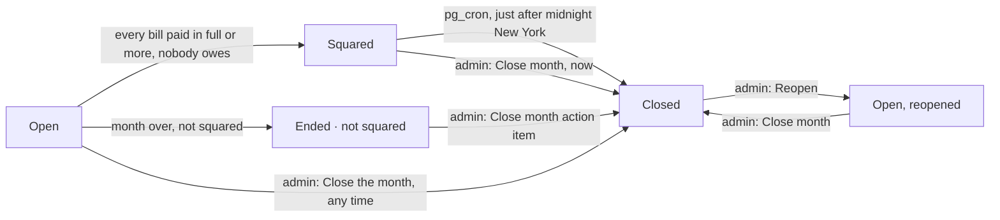
```mermaid
flowchart LR
  Open -->|every bill paid in full or more, nobody owes| Squared
  Squared -->|pg_cron, just after midnight New York| Closed
  Open -->|month over, not squared| Ended["Ended · not squared"]
  Ended -->|admin: Close month action item| Closed
  Open -->|admin: Close the month, any time| Closed
  Squared -->|admin: Close month, now| Closed
  Closed -->|admin: Reopen| Reopened["Open, reopened"]
  Reopened -->|admin: Close month| Closed
```

An admin can close any open month by hand (Vin, 2026-10-06; REQ-59 had it
only for a month that ended owing). The "ended, not squared" and "squared"
action items, and a "Close the month" card at the bottom of the month's
page, all open `/finances/close-month`, which says who owes what or that
everything is paid, and that closing locks the month (and, for one still
running, that nothing more can be added). The database function
`close_month_with_balance` never required the month to be over or
unsquared, so this needed no migration.

**Reopening.** Closing isn't a dead end: an admin can reopen a closed month
from its page (`reopen_month()`, `manage_budget` only, a closed month only).
The month's closing record (`month_people`) is removed, since closing writes
it again, and it is open: the lock lifts, `closed_at`, `settled` and
`split_from` are cleared. `months.reopened_at` / `reopened_by` remember it,
because the nightly job would otherwise close a reopened, squared month at
the next midnight; `close_squared_months()` skips any month with
`reopened_at`, so it stays open until an admin closes it again. Its "squared"
action item then says so instead of "Closes tonight".

- **Squared** is worked out twice, on purpose: `monthStatus()` in the
  app for Home's tile and the action items, and `month_balances()` / `month_is_squared()`
  in the database for the nightly close, which runs without the app.
  Both use the same rule, including who takes the rounding cent.
- **The nightly close** is a pg_cron job, `close-squared-months`, at
  five past every hour (UTC). It does its work only in the hour after
  midnight in New York, which lands on a different UTC hour in summer
  and winter.
- **Closing with a balance** is `close_month_with_balance()`: admins
  only (`manage_budget`), every bill entered. Nothing carries into the
  next month; the unpaid amount comes back on the real statement and is
  declared as that person's personal charge.
- **The lock** is a trigger on `month_bills`, `personal_charges`,
  `direct_payments` and `payments` that refuses any insert, change or
  delete in a closed month. Removing a bill from the household list is
  let through (it only empties the copy's `bill_id`). Removing a member
  who appears on a closed month is refused (`month_people` restricts
  it), so the record never loses a person.
- `month_balances()` and `month_is_squared()` are for the database's
  own use only; signed-in users can't call them.
- **Income** isn't locked by closing alone: a month can square and
  close mid-month while pay is still to land, so income locks once the
  month is closed *and* over.

`/finances/income` lists the paychecks the income sources expect up to
today, to confirm, and takes any other income by hand. Finances home's
verdict card is each person's income minus their obligation, and the
two together (REQ-61).

### Months added later

A household that started partway through the budget year can fill in
the months before it (REQ-148). History lists every month of the budget
year so far (April to March); one never opened reads "Not entered", and
Add calls `add_past_month()`. That opens it through the same
`create_month()` (today's bill list, rent pre-filled), but only for an
earlier month of the current budget year, and marks it `added_later`.

| Table / column | One row is | Key facts |
|---|---|---|
| `months.added_later`, `settled` | filled in afterwards; closed as settled between us | set only by `add_past_month()` and `settle_past_month()` |
| `month_shares` | one person's percentage in a month added later's own split | a copy of the split in force then, or of today's if none had started; changed only by `set_month_split()` while the month is open |

The household's dated splits are never touched, so a split already past
stays history. `month_balances()` and `monthShares()` divide an open
month by its own split when it has one; once closed, by what was
written on it, as before. Such a month expects paychecks from each
person's sources in force then, or their current ones if HomeBase knows
none (`sourcesForMonth()`), and each can be changed as it's confirmed.

`settle_past_month()` closes it with every bill entered and nobody
owing anything (`month_people.outstanding` is 0): it changes nothing
anyone owes today. Paying it off and closing it as usual also works.
Either member may add, change the split of, or settle such a month.
It raises no action items, so it sends no notifications: `financeItems()`
leaves it out. It counts everywhere else like any other month.

### Savings

What a month allows into joint savings is worked out, never stored:
`savingsPlan()` in `lib/finances/savings.ts` takes each person's
leftover and has each put in half the lower one, rounded down to the
dollar (REQ-63). If anyone's leftover is zero or below, nobody saves
jointly and the verdict card says why in words (REQ-64). Only what was
actually put away is stored (REQ-66):

| Table | One row is | Key facts |
|---|---|---|
| `month_savings` | one person's savings for a month | `to_joint`, `own`, both 0 or more; any member records, corrects or removes it for either person, and it stays open after the month closes, because saving happens after the month ends |

`/finances/savings` shows this month's plan, the form, and each closed
month with what was saved beside what was available.

## Finances balances

Each person's account balances, entered once a month (REQ-67). A
balance month is a plain calendar month, not a row in `months`: balances
can be entered whether or not that month's bills were opened, and
closing a month doesn't lock them.

| Table | One row is | Key facts |
|---|---|---|
| `balances` | one person's balance in one account for a month | `month` (the 1st), `user_id`, `account` (401k, espp, rsu, investments, cash), `amount` 0 or more; an account left blank has no row, so the gap shows; any member enters, corrects or removes either person's |

Everything else is worked out in `lib/finances/balances.ts`:
`startingPoint()` pre-fills a box from the latest earlier month,
`balanceTrend()` gives each month's total, its change (over the accounts entered in both months, labelled "on the same accounts" when one is missing) and every
account's change (REQ-68), and `cashCheck()` sets a person's cash beside
their leftover from `leftovers()`, flagging more than `CASH_GAP_FLAG`
($500) over (REQ-65). `/finances/balances` shows the form, the cash
check and the trend. On desktop, an SVG line chart drawn in our own
code (`chart.tsx`, no chart library) shows the total.

## Finances action items and reminders

Home's Action items card and the Finances tile now show real items
(REQ-91, REQ-93). [`lib/finances/action-items.ts`](../lib/finances/action-items.ts)
works out one person's items from a snapshot of the Finances data
([`lib/finances/snapshot.ts`](../lib/finances/snapshot.ts): the split,
the months opened in the last year, balances, acknowledgements). Nothing
is stored per item: each clears when the data it watches changes. Each
item carries a rank (month-ended and bill-due-soon first), a link to the
exact screen (Log payment opens with the bill picked via `?bill=`), and,
for the six moments REQ-70 names, a push: its text has no dollar figures
and its *topic* says when a repeat is due (a new month, another fortnight).

Three things can't be worked out, so they are stored:

| Table / column | One row is | Key facts |
|---|---|---|
| `month_bills.entered_by` | who entered a bill | set by `enter_bill()`; rent the month pre-enters has none; drives "numbers are ready" |
| `action_item_acks` | a person having seen or acknowledged an item | `user_id` + `key` (e.g. `ready:2026-09-01`); each person reads and writes only their own; opening Finances home records "ready", **Got it** on Balances records "cash-gap" |
| `finance_pushes` | a push already sent | `user_id` + `topic`; only the secret key touches it |

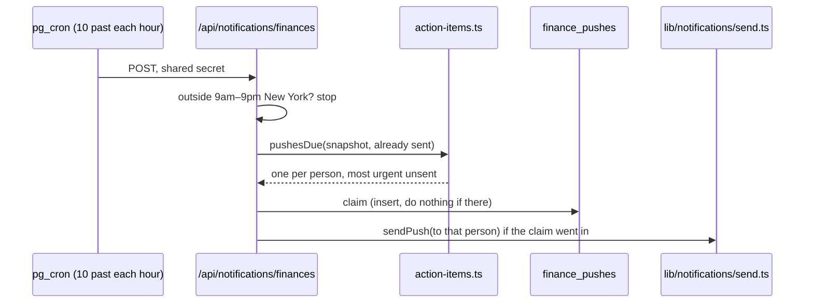
```mermaid
sequenceDiagram
    participant Cron as pg_cron (10 past each hour)
    participant Route as /api/notifications/finances
    participant Items as action-items.ts
    participant DB as finance_pushes
    participant Send as lib/notifications/send.ts
    Cron->>Route: POST, shared secret
    Route->>Route: outside 9am–9pm New York? stop
    Route->>Items: pushesDue(snapshot, already sent)
    Items-->>Route: one per person, most urgent unsent
    Route->>DB: claim (insert, do nothing if there)
    Route->>Send: sendPush(to that person) if the claim went in
```

The job reuses the test notification's vault secrets; it keeps only the
origin of `notify_url` and calls `/api/notifications/finances` there.
`sendPush()` is the test notification's sender made general: it still
skips anyone whose notifications switch is off, and logs each device
under the trigger `finances`. See [lesson 23](lessons/23-to-dos-that-clear-themselves.md).

## Paperwork

The second module to open (REQ-88, REQ-97), slate and last on Home. It
records the household's physical files and the paperwork in them, so
anything can be found without searching the cupboards.

| Table | One row is | Key facts |
|---|---|---|
| `paperwork_categories` | a category the admin made | `name` unique ignoring case, `keep_years` optional (1–100); only `manage_paperwork` (Admin) adds, changes or removes; one in use can't be removed (`on delete restrict`) |
| `paperwork_locations` | a place files are kept (REQ-179) | `name`, unique ignoring case and extra spaces; any member adds, renames or removes one; a location with any file (active or archived) can't be removed (`on delete restrict`) |
| `paperwork_files` | a physical file with a printed label | `number` handed out by the database (`generated always as identity`): it counts up, can't be chosen or changed, and a removed file's number never returns; shown as `F-0042`; `category_id`, `location_id` (the last office location; the old `location` text is kept in step by a trigger until a later migration drops it), `label` optional, `status` active/archived; archived means `storage_entry_id` names the box it's in, and the database holds the two together (REQ-98) |
| `paperwork_archives` | a storage box's archive of single documents (REQ-153) | `storage_entry_id` (unique, a box only); made the first time a document is archived into the box; no F-ID, category or label, so it never uses a file number; nobody changes or removes one, it goes with its box, and a box whose archive holds documents can't be removed |
| `paperwork` | one paper | `name`, `owner_id` (null = Joint), `document_date`, `notes`, `keep_until`, `logged_on` (household's today); `file_id` null = Unfiled; `archive_id` set = archived on its own (never both: the database refuses); removing a file sets its papers back to Unfiled |

Every member reads everything and logs, files, moves and removes files
and paperwork. [`lib/paperwork/paperwork.ts`](../lib/paperwork/paperwork.ts)
reads it all in one go (the household is small) and works out the
places, files, search and keep-until (document date, or the logged date,
plus the category's years).

The screens work like a filing cabinet (REQ-100) and follow the module
home rules (DESIGN.md §11): Overview → a location's files → a file's
documents (the UI calls each paper a document). A location is a record
(`paperwork_locations`, REQ-179): the Overview lists every one, empty
ones too, with Add location; a location's screen has a Manage location
menu (Rename; Delete only when nothing is in it). A file picks its
location from that list or makes a new one inline, never free text. A
storage box holding archived files, or an archive of single documents
(REQ-153), is a place too. An archive shows beside its box's files; a
document is archived from its own page and brought back to Unfiled.
Routes: `/paperwork` (action item, summary, locations, archived boxes),
`/paperwork/locations/[id]`, `/paperwork/boxes/[id]`,
`/paperwork/archives/[id]`,
`/paperwork/files/[id]`, `/paperwork/items/[id]`, `/paperwork/unfiled`,
`/paperwork/categories` and `/paperwork/categories/[id]` (every member
browses a category's documents by year, with empty years shown as gaps,
REQ-105), and `/paperwork/settings` (admin: manage categories, behind the
header's gear, not a tab). The tabs are Overview, Unfiled and Categories.
[`app/paperwork/frame.tsx`](../app/paperwork/frame.tsx) draws every
screen's header (search, settings gear, Log document), tabs and
breadcrumb; a search is `?q=` on whatever screen it was typed on, and its
results replace that screen. Forms open in sheets
([`app/paperwork/sheets.tsx`](../app/paperwork/sheets.tsx)) so you stay
where you are; a form that makes a file returns its label, shown once to
print, instead of opening the file.

### Google Drive files (REQ-152, REQ-153)

A File can live in one Google Drive folder instead of a cupboard. The
documents stay in Drive; HomeBase links a File to its folder by the
folder's **Drive ID, never its name**, and keeps a copy of what it last
saw so pages open fast.

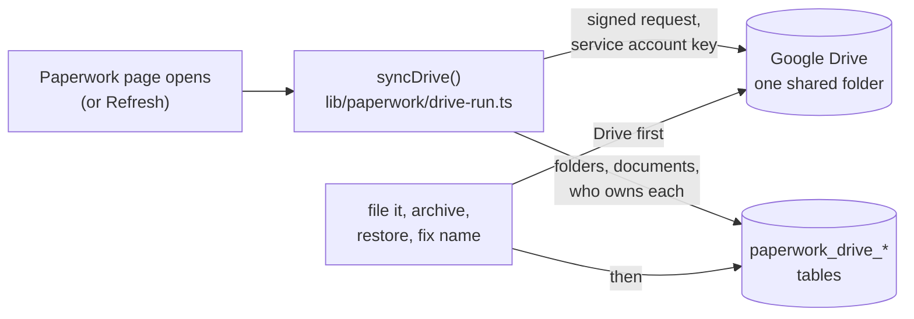
```mermaid
flowchart LR
  Page["Paperwork page opens<br/>(or Refresh)"] --> Sync["syncDrive()<br/>lib/paperwork/drive-run.ts"]
  Sync -- "signed request,<br/>service account key" --> Drive[("Google Drive<br/>one shared folder")]
  Sync -- "folders, documents,<br/>who owns each" --> Copy[("paperwork_drive_*<br/>tables")]
  Action["file it, archive,<br/>restore, fix name"] -- "Drive first" --> Drive
  Action -- "then" --> Copy
```

| Table | One row is | Key facts |
|---|---|---|
| `paperwork_drive` | the one connected folder | `id` is always `true`, so one row; `folder_id`, `archived_folder_id` (the `Archived` sub-folder found when connected), `synced_at`; only `manage_paperwork` (Admin) connects; a member's sync stamps the time through `record_drive_sync()` |
| `paperwork_drive_folders` | a sub-folder last seen (a File's, or one nobody linked) | `drive_id`, `name`, `in_archived`, `ignored` (the admin chose), `missing` (gone from Drive; never dropped) |
| `paperwork_drive_documents` | a document directly in a File's folder, `Archived` or the top folder | `drive_id`, `name`, `link`, `parent_id`, `drive_owner_email`, `owner_id` (null is Joint) with `owner_set`; `missing`; only the admin removes a missing one's record |

Other changes: `paperwork_files.is_drive` (set when made, never changes)
and `drive_folder_id` (null while "Waiting for folder"); a Drive File is
archived by moving its folder into `Archived`, so it is archived without
a storage box (the archived-in-a-box check has a Drive branch);
`paperwork_locations.built_in = 'drive'` is the Google Drive location,
which a trigger stops being renamed or removed, and the database refuses
a physical File there or a Drive File anywhere else;
`household_members.google_email` (admin, optional) is compared with
Drive's document owners.

**Talking to Drive.** [`lib/paperwork/drive.ts`](../lib/paperwork/drive.ts)
is plain REST with no Google library: it signs a short-lived token
request with the service account's private key (Node `crypto`, RS256),
then lists, moves and renames. The key is `GOOGLE_DRIVE_SERVICE_ACCOUNT_KEY`
in Vercel (the key file as it is, or base64 of it), never in git. The
admin shares the one folder, and its `Archived` sub-folder, with the
service account's email as Editor. What it may do was tried on a real
folder on 2026-10-06: move a document, move a folder and rename a folder
are all allowed (Notion decision "Drive access test"), so all three have
buttons. The app never makes folders.

**Sync** ([`drive-sync.ts`](../lib/paperwork/drive-sync.ts) decides,
[`drive-run.ts`](../lib/paperwork/drive-run.ts) does): opening Paperwork,
or Refresh, reads the connected folder, `Archived` and each linked File's
folder, then updates the copy. A folder or document Drive no longer has
is marked Missing, never dropped; a File follows its folder into or out of
`Archived`; a document in a File's folder with no owner decided takes the
member whose Google account owns it, else "Owner not set". Anything
deeper than one level inside a File's folder is ignored. If the connected
folder itself can't be seen, sync says so and marks nothing Missing.

**Changes** go to Drive first and the database after
([`app/paperwork/drive-actions.ts`](../app/paperwork/drive-actions.ts)),
so a refusal from Drive leaves HomeBase unchanged. The app is the source
of truth for names: a linked folder named differently shows the admin
"Folder name doesn't follow convention" with a Fix that renames it, and
renaming a category, or changing a File's category or label, renames its
folders. Category names can't contain
"_". Drive documents go only into Drive Files and physical paperwork only
into physical Files. Routes added: `/paperwork/archives/drive` (the Drive
archive File: `Archived`'s loose documents, with archived Drive Files).
Drive documents aren't searched, don't count toward Home's unfiled tile
(the Overview and Unfiled tab show "Unfiled · Google Drive"), and have no
page of their own: a name opens the document in Google Drive.

Home's "N documents unfiled" is an action item from
[`lib/paperwork/action-items.ts`](../lib/paperwork/action-items.ts),
ranked after every Finances item; the Overview shows the same item with
when the oldest was logged. Like Finances' items it clears itself:
filing the last document is the "done". It sends no push.

Module pages now share [`components/module-frame.tsx`](../components/module-frame.tsx)
(header, section tabs, phone bar) and
[`components/cards.module.css`](../components/cards.module.css) (the
cards first drawn for Budget year), so a module looks like itself by
setting its colour tokens, not by copying Finances.

Module homes follow one set of rules (DESIGN.md §6, REQ-103), applied
first to Finances: the header names what you're looking at
("Finances — September 2026"), its buttons use the one button in
[`components/button.tsx`](../components/button.tsx), admin settings sit
behind a gear rather than a tab, and every card is white with a
module-colour border. A section can be `hidden` (Finances' Savings,
while `SAVINGS_PAUSED`), and a `monthly` one keeps `?month=` in its tab
link so a past month opened from History stays in view across tabs.

## Storage

The third module to open (REQ-87), teal and last on Home. It logs
everything in the basement, boxed or not, so anyone knows which box to
open. Paperwork files can be archived into its boxes (REQ-98).

| Table | One row is | Key facts |
|---|---|---|
| `storage_entries` | a box or a loose item | `number` handed out by the database like a file's, shown as `S-003`; `name`, `is_box`, `contents` (one item per line, boxes only: a check refuses contents on a loose item), `note`; every member reads, adds, changes and removes |

Two rules span both modules, each a trigger on the table whose write
would break it: a file can only be archived into a box
(`refuse_file_outside_a_box` on `paperwork_files`), and a box holding
archived files stays a box (`refuse_unboxing_with_files` on
`storage_entries`). A box holding files can't be removed either
(`on delete restrict`). The app checks the same things first, so people
see "move them first" rather than a database error.

[`lib/storage/storage.ts`](../lib/storage/storage.ts) reads the entries
and does search (ID, name, contents, note) and the contents preview.
Pages live under `/storage` (REQ-107, laid out like Paperwork): the
home, with entries grouped as Boxes and Not in a box, and an entry's
page (contents, note, archived files linking to Paperwork). Every screen
has the header search, whose results replace the view, and Add to
storage, a sheet whose one-time notice shows the new ID to print. Edit,
the label and Remove (after a confirm) are behind the entry's Manage
menu. Storage's stylesheet borrows Paperwork's shapes with `composes`
rather than copying them (see [lesson 25](lessons/25-a-screen-that-stays-put.md)). Paperwork's file page archives
a file or brings it back; its files list hides archived files until
asked. Home's Storage tile only counts entries; it raises no action
items.

## Drinks

The fourth module to open (v2.0, REQ-37, REQ-30, REQ-29), violet, in
the place Wine had on Home: the tile was called Wine until v2.0, and the
requirements call it Drinks. It records every wine we've had and what
each of us thought of it.

| Table | One row is | Key facts |
|---|---|---|
| `drinks` | a wine | only `name` is required; `producer`, `type` (one of seven), `vintage` or `non_vintage` (never both), `grapes` (a list), `region`, `country`, `abv`, `bottle_ml`, and for sparkling `sweetness`, `method`, `disgorged_on`; `how` we got it (`bought`, `gift`, `had_out`, `want_to_try`) with its optional extras `price`, `place`, `gift_from`, each allowed only with its value by a check; `front_label` and `back_label`, where the label photos are in Storage (a back only with a front); every member reads, adds, changes and removes |
| `drink_ratings` | one person's rating of one drink | primary key `(drink_id, user_id)`, so one each; `stars` 1–5, a one-line `comment`, `buy_again` (yes, no or null); `updated_at` stamped by a trigger; refused on a Want to try drink (`refuse_rating_untried`), and a rated drink can't go back to Want to try (`refuse_untrying_rated`); everyone reads, each person writes only their own row (`user_id = auth.uid()` in the policies); removed with its drink |

The standard lists (types, grapes with their other names, countries,
regions, sparkling sweetness and methods) live in the code,
[`lib/drinks/lists.ts`](../lib/drinks/lists.ts), not the database: the
add form offers them as suggestions and search files spellings together
(Shiraz finds a Syrah), while the drink keeps what was typed.
[`lib/drinks/drinks.ts`](../lib/drinks/drinks.ts) reads drinks and
ratings, and does search, the type filter and the sort. Pages live under
`/drinks`: the Overview, a one-line summary (wines recorded, had, want
to try) and the three most recently added drinks; the Wines section
(`/drinks/wines`), the full list, whose search, type and sort are one
form kept in the address; the same list for Want to try
(`/drinks/want-to-try`), which Wines leaves out. A drink's breadcrumb
goes back to whichever of the two it belongs in. Add a drink (`/drinks/new`) and Edit, full pages because
the form is long; and a drink's page, with every member's rating by name
and a Rate sheet. Home's Drinks tile only counts drinks. See
[lesson 26](lessons/26-rows-that-belong-to-one-person.md) for how a
rating stays its owner's.

### Label photos and scanning

Drinks is the first module to keep files, so it's the first to use
**Supabase Storage**, the file store that comes with the database (no
new service or account). Photos go in one private bucket,
`drink-labels`, which takes only JPEGs up to 1 MB. Policies on
`storage.objects` let household members read and write it and nobody
else; nothing in it has a public address. Pages show a photo through a
signed link the server makes for the signed-in member, good for an
hour ([`lib/drinks/photos.ts`](../lib/drinks/photos.ts)).

```
phone photo (3–12 MB)
  → browser shrinks it: long side ≤ 1600 px, JPEG under 450 KB,
    plus a 240 px copy for the list        (lib/drinks/shrink-photo.ts)
  → sent with the drink's form (server actions accept up to 2 MB,
    next.config.ts)
  → the action uploads both under the drink's id, then saves the row
    with their paths; if the row fails, the uploads are removed
```

Scanning is the browser's file picker: `capture` opens the phone's
camera, and without it the photo library. The header's Scan opens the
camera on the page you're on; the photo waits in the browser's memory
([`app/drinks/scan/pending.ts`](../app/drinks/scan/pending.ts)) while
the app moves to the scan screen (`/drinks/scan`), which has Cancel
instead of the header's buttons. There: Read it, Add back label (from
the camera or the library, whichever the front came from; a back photo
is read straight away) or Retake. Opened on its own, the scan screen
offers the camera or Choose a photo. The photos go to
`readLabel`, which hands them to the label reader (below). The review screen is the Add
form filled with what was read, next to the photos; nothing is stored
until Save. A drink without photos gets them later from Manage. See
[lesson 27](lessons/27-private-photos.md).

### Reading the label, and the shop check

Reading uses **Google Cloud Vision**, an outside service (a Notion
decision of 2026-09-20; about 60 photos a month, inside its free 1,000).
It's the app's first call to a paid outside API, so here is how it's
wired:

```
review screen ──readLabel (server action)──▶ Vision images:annotate
                                              (both photos, one request,
                                               key from GOOGLE_VISION_API_KEY)
                ◀── lines of text, each with its printed height and
                    Vision's confidence            (lib/drinks/vision.ts)
                ── parseLabel: lists and patterns → drink fields,
                   doubtful ones marked            (lib/drinks/parse-label.ts)
                ── shopCheck: same producer + name + vintage? (lib/drinks/match.ts)
```

- The key lives only in Vercel (Production and Preview), marked
  Sensitive, and is read on the server; the browser never sees it. The
  Google Cloud project `HomeBase` has billing on, a $5 budget alert,
  and the key is restricted to the Vision API.
- Without the key (a laptop), `noReader` finds nothing and the review
  screen asks for the details by hand. If Vision fails or takes over 9
  seconds, the same happens and Sentry is told.
- The shop check runs on the server right after reading, against every
  drink and rating, and comes back with the reading: "We've had this"
  (with everyone's stars, comments and buy again, Open existing or Save
  as new), a near match (a different vintage), a want-to-try call-out,
  or "New to us". A name that's only a grape, region or kind of wine
  (`isGenericName`: "Pinot Grigio", "Rioja") matches only with the same
  producer, found in either field, and is shown with its producer first
  (`displayName`). Any other name matches even when the reading split it
  between producer and name, and runs again (`checkDrink`) half a
  second after the name, producer or vintage is corrected on the review
  screen. Nothing is saved to answer it. See
  [lesson 28](lessons/28-reading-a-label.md).

## Meal Plans

Meal Plans (v2.0, REQ-110 to REQ-112) starts with recipe cards. A
recipe (`recipes`) holds its name, a photo, the video and recipe page
links, cuisine, main meat, one of four cooking methods, cook time,
servings, ingredients as a list of `{ quantity, unit, item, note }`
(so a later batch can scale them), steps and notes. Cuisines come from
`cuisines`, which starts with the common ones and gains a new one the
first time a saved recipe needs it. Photos live in a private
`recipe-photos` bucket, with the same signed links and small copies as
drink labels. Any member can add, change and remove any recipe.

A recipe arrives three ways: typed in by hand, pasted as text in any
form, read from a downloaded video (always marked BETA), or read from
pictures (REQ-157). The last three go through **Gemini** (`gemini-3.8-flash`), Google's AI model, an
outside service with its key in Vercel as `GEMINI_API_KEY`, read only
on the server. `lib/meal-plans/gemini.ts` calls its web API directly;
there is no Google library. Nothing is saved as a recipe until someone
reviews the draft: a draft lives in `recipe_imports`, which only its
starter can see, and saving it makes the recipe and removes the draft.

A fourth way has no video (REQ-112, flows 2 and 3). The server asks
Gemini to search the web with its **Google Search** tool, the same key
and account (Vin, 2026-09-27); Google's redirect links are followed to
the real pages, and Google's "search suggestions" are shown with them,
as its terms ask. The page someone picks is **downloaded by our
server** (`lib/meal-plans/recipe-search.ts`), which only fetches public
https addresses and checks every redirect, and Gemini drafts the card
from that page alone; `recipe_imports.page_url` keeps the link. With no
page picked, the card is saved as "Recipe missing" (no ingredients and
no steps, nothing stored for it). Gemini's generic version of such a
card is a draft with `recipe_id` and `ai_generated`; saving it fills
that card and sets `recipes.ai_generated`, which any edit clears. See
[lesson 31](lessons/31-searching-and-fetching-the-web.md).

Add recipe starts with the name (REQ-174). "Save for now" (`saveForNow`)
saves the name as a "Recipe missing" card with no review step; Gemini
(`cuisineFromName`) is asked for a cuisine from the name alone, may only
name one of the cuisines we keep, and only when confident, and the card is
saved without one if it isn't or doesn't answer. It never writes a recipe
there. Every other way to add (video, images, page link, web search, typed
text) can instead fill an existing "Recipe missing" card: its draft carries
the card's id in `recipe_imports.recipe_id`, checked again when the draft is
made and when it is saved, so the card keeps its id and with it its ratings
and cooked history. The plan's add control can also make one (REQ-180): "Add new recipe"
sends the same name-only card (`createNameOnly` in
`lib/meal-plans/name-only.ts`, shared with `saveForNow`) through
`addToPlan`, which makes it only once its meal is certain and puts it in
the plan without leaving the page. A name already used by a recipe, hidden
ones included and ignoring capitals and extra spaces, makes no card: the
form picks that recipe instead. The week's list marks such a card
"Recipe missing". The library's filters end with "Not set" for cuisine,
main meat, method and cook time; a recipe without a cook time is ranked on
rating and days since last cooked at the middling gap.

### The week's plan and the library (REQ-113 to REQ-115)

`meal_plans` holds one plan per week, started on any day. Two partial
unique indexes allow one open plan that is current and one open plan
`ahead` (REQ-162), so two people starting a plan at once can't make two
of either. The plan ahead is queued behind the current one: it starts at
the meal after the current plan's last filled meal (a weekend lunch, else
the next dinner; `nextWeekStart` in `meals.ts`, REQ-170), and `syncAheadStart`
(`lib/meal-plans/plan.ts`) rewrites its stored start whenever the
current plan's entries or start day change; reading also works the
start out, so a page is right even if a write was missed.
`meal_plan_recipes` holds a plan's entries (REQ-168): each has its own
`id` and is either a dish (once per plan) or an evening out
(`eating_out`, no recipe), with an optional cooked tick. Each entry is
written onto the meal it starts at (`meal_on`, a day, and `meal`, lunch
or dinner) with a size of `meals` 1 or 2; a 2-meal dish also covers the
meal after, its leftovers. A plan stores its `starts_meal` (dinner, or
lunch on a weekend day when we choose), and `meal_plan_days_off` holds the
days we marked as a Day off, which count as weekend days for it. The rules
(where an entry can start, the next free meal, the reflow when a start
slides or a dish is swapped, how far a plan reaches) are plain code in
`lib/meal-plans/meals.ts`, which never touches the database. Writes go
through `set_plan_layout`, one step on the database, run as the person
asking so the same row rules apply; it also refuses two entries on one
meal. Placement lives on the entry and says nothing about its recipe, so
a later change can give an entry several recipes. Removing a plan removes
its rows. `position` and `servings` are left from the earlier model and
are dropped by a later migration. Days before today (ET) are locked in a
plan that has started; a plan ahead never is. Eating out on a dinner
with a dish (REQ-169) pushes that dish and every later dish back a day
(`pushBack` in `meals.ts`) and the app sends the whole result to
`push_plan_back`: dishes that no longer fit the week are taken off and
remembered in `meal_plan_proposed_next` (a recipe once; the app clears it
when the recipe is planned again), the others are rewritten, and a new
Eating out is added, all in one step. Once next week's plan exists the
plan page proposes those recipes first, to add to it. A recipe's "times cooked" and "last cooked" (REQ-175) aren't stored: they're
counted from these rows each time (`lib/meal-plans/plan.ts`): each dish
in a plan that has closed counts once if it is marked `cooked`, on the day
it was cooked (`meal_on`). A dish marked "Didn't cook this", one in a plan
still open and an Eating out count for nothing, so taking a dish off a
plan can't leave a stale count. The library's sort, the suggestions'
ranking and Home's "Most cooked" all read the same counts.
`recipes.hidden` keeps a
recipe out of the library without deleting it.

`meal_plan_settings` is a single row for the household (REQ-172): `repeat_recipes`,
off by default, switched from the bottom of the module home by either of us.
Off, adding a recipe that is already in the plan we're on or next week's is
refused by the app, and the add list and suggestions leave it out; on, none of
that applies, so the database no longer has a one-row-per-recipe-per-plan rule.

### The plan lifecycle (REQ-163)

A plan has a `status`: `new` until someone presses Start (a plan ahead is
always new), `started` while it runs, `closed` after. Locking by day
applies only to a started plan; a new one slides instead. Three things run
without anyone signed in, in `lib/meal-plans/schedule.ts`, called every
hour, on the hour, by a `pg_cron` job (`meal-plan-schedule`) that posts to
`/api/notifications/meal-plan` with the same shared secret as the Finances
job: it closes a started plan the day after its last filled meal
(`close_meal_plan_system`, callable only by the server's own key), slides a
new plan whose start day is over (its dishes move with it by the reflow
rule, and next week's plan follows), and sends "Start this week's plan?" to
everyone switched on, at 11:00 AM for a lunch start and 6:00 PM for a
dinner start (ET, once per plan per day: `start_prompted_on` claims it). The
notification opens the plan page with the plan in the link; `began_by` records
who pressed Start, so a second person who opens it late is told who did.
When a plan closes, every dish counts as cooked (`cooked`) unless it was
marked `didnt_cook`, and each of us gets a rating question for a dish cooked
for the first time. `set_didnt_cook` changes the mark after closing too:
the dish stops counting and its questions go, or counts again and the
first-time question comes back. The closing cards on the plan page are the
last closed plan's dishes (for a week); a dish we didn't cook is offered
"Add to next week", or, with no plan for next week yet, is stored in
`meal_plan_proposed_next` and proposed first when one is created. The old
`carry_over` and `cooked` ticks are gone from the screen; the columns stay
until the later migration that drops the old model.

### Closing a week, rating and suggestions (REQ-116, REQ-117)

Closing and starting plans happen in three database functions, so each
is one step no matter who else is using the app: `close_meal_plan`
marks every recipe cooked except those with `carry_over`, writes a
rating question into `recipe_rating_prompts` for every household member
for each dish cooked for the first time, and sets `closed_at`.
`start_meal_plan` starts a plan, at dinner or a chosen weekend lunch;
with one current it becomes the plan ahead and nothing is closed (REQ-162), and closing the current plan
makes the plan ahead current. An evening out is never rated.
`reopen_meal_plan` opens the last plan closed again, while no other is
open, and takes back its unanswered questions. `recipe_ratings` holds
one 1–5 rating per person per recipe; a trigger removes the matching
question when someone rates. Each person sees only their own
questions; everyone sees every rating. A closed plan's recipes can't be
added, changed or taken off (the row-level rules check
`plan_is_open`), so a screen left open can't change a finished week.

Suggestions (`lib/meal-plans/suggest.ts`) aren't stored: they're worked
out on the server from the whole library on every visit, from the
ratings, the plan rows and each recipe's cook time. Carried-over recipes
come first. "Not now" is kept in the page's address (`?skip=`), so it
lasts for this visit and nothing is written.

Meal Plans' home (REQ-118) reads the same rows: this week's recipes and
their photos, and the fun numbers from `lib/meal-plans/home.ts`. Home's
Quick add "New meal plan" sheet uses the same start-a-plan form and
function, so starting from Home queues the next plan while one is
running (REQ-162), and the button is gone once a plan and the one after
it both exist.

Scaling (`lib/meal-plans/scale.ts`) is plain arithmetic shared by the
screen and the server: the browser shows the scaled card and sends only
the ratio when saving, and the server scales the stored card itself.
Why the rule lives in an index and why the counts aren't stored:
[lesson 30](lessons/30-one-open-plan-and-counting.md).

### Pictures' trip (REQ-157)

Pictures are small enough to pass through our server, so there is no
upload link: the phone shrinks each one (the drink-label shrinker, a few
hundred kilobytes) and sends them all, with a small copy of each, in one
request to `startImagesImport`. Together they can't pass 2.5 MB (Vercel's
limit is about 4.5 MB; `bodySizeLimit` in `next.config.ts` is 4mb), and
3 is the most. The row goes straight to `processing`, and `after()`
hands the pictures to Gemini inline (no file stored at Google), which
reads them as one recipe and names the one that shows the finished dish,
or none. That one and its small copy become the
draft's photo; the pictures themselves are never stored. The same toast
reports back. No new table or column.

### A video's trip

A video is too big to pass through our server (Vercel takes about
4.5 MB a request), so the phone sends it straight to Google:

```
Add recipe ──startVideoImport──▶ server: keeps name, link; opens a
   (phone)                        one-time upload link at Google;
                                  row = uploading (source = video)
phone ──8 MB pieces──▶ Google's upload link (no key; that one file only)
phone ──videoProgress──▶ server asks Google how much arrived
                         all of it: row = processing, answer, then
                         after(): wait for Google → Gemini reads it
                         → row = ready (draft) or failed → delete video
toast (every page) ──myRecipeImports every 15 s──▶ "Recipe ready"
```

- REQ-156, the card's photo: while Gemini watches the video for the
  recipe it also names the second where the finished dish is on screen
  with no person in view (`recipe_imports.photo_at`; it can only say
  when, in text). Only the phone has the video (Google won't give it
  back, our server never held it), so that phone keeps the file in this
  tab's memory (`lib/meal-plans/kept-video.ts`) and, when the toast sees
  the recipe is ready, cuts that frame out, shrinks it and sends it
  (`setDraftFrame`) to wait as `imports/<id>/frames/1.jpg` in the
  `recipe-photos` bucket, no table, before the note says "Recipe ready".
  The review shows it with "No photo"; saving copies it to the card, and
  removing or saving the draft deletes it. If HomeBase was closed or
  reloaded on that phone before the recipe was ready, or no moment
  qualified, the card has no photo and the review says which. Nothing
  random is used. `recipe_imports.source` ('video' or 'images') says
  which kind a draft is, for the BETA label and the photo choice.
- The phone never reads Google's answer to the last piece: once a video
  sent in pieces is complete, Google's answer lacks the header that
  lets a browser read it (seen 2026-09-26). The server asks instead,
  with the upload link it keeps on the row.
- An iPhone pauses a web app soon after you switch away. A failed piece
  waits until HomeBase is on screen again and carries on from what
  arrived. Moving around HomeBase doesn't stop an upload; closing or
  reloading it does. Not yet tried on an iPhone.
- Reading happens after the server has answered, using Next.js
  `after()`, with the admin client because no one is waiting on a
  page. Vercel runs `after()` work until the function's time limit;
  that hasn't been checked on Vercel yet. An import still processing
  after 10 minutes, or uploading after 2 hours, is marked failed the
  next time the toast asks.
- The toast (`components/recipe-toast.tsx`, in every page's frame) only
  asks the server while this browser has an import going (a note in
  localStorage), and shows sending progress, "Reading…", "Recipe
  ready" or a plain failure. See
  [lesson 29](lessons/29-work-after-the-answer.md).

## Restaurants

Places we want to try and have tried (REQ-90, REQ-129 to REQ-133),
saved by pasting a Google Maps, Apple Maps or OpenTable link. Module
home `/restaurants` is Want to try, with "Go again?" above it for tried
places you haven't answered for; `/restaurants/new` adds a place;
`/restaurants/[id]` is one place (Book, Open in Google Maps, Mark as
tried, or once tried, both answers and Undo).

| Table | One row is | Key facts |
|---|---|---|
| `restaurants` | a place on our lists | `google_place_id` (unique), `added_by`, `created_at`, `booking_url`, `tried_on` (empty = Want to try) |
| `restaurant_answers` | one person's "go again?" for one tried place | key `(restaurant_id, user_id)`, `go_again` yes/no; no row = still asking |

- Only `booking_url` and `tried_on` can be changed (a column grant);
  which place a row is never changes.
- You write only your own answer, and only for a tried place. Undoing
  tried clears both answers through a `security definer` trigger, the
  one place anyone's answer but your own is removed (lesson 26).
- Home's Restaurants tile says how many are left to try, and turns into
  an action item, "Go again? N places", for whoever hasn't answered.

Google's terms let us keep a place's ID and
nothing else from Google, so the name, photo, cuisine, neighbourhood,
address, hours and website are asked of **Google Places** (the "new"
Places API, a second outside Google service) every time a place is
shown. Think of it as keeping a library card number, not a photocopy
of the book.

```
paste a link ──lookUpPlace──▶ readLink (lib/restaurants/links.ts)
                               ├─ share link? follow its redirects
                               │  (maps hosts only, 5 hops at most)
                               ├─ place ID in the link → Place Details
                               ├─ name + spot → Text Search near it
                               │  → pickMatch: same name within 150 m?
                               │    one to confirm, else up to 3 within 1 km
                               └─ OpenTable: name (+ city) from its address,
                                  never fetched → Text Search, name must agree
confirm ──addPlace──▶ insert { google_place_id, booking_url } (database adds who, when)
        (already saved without a booking link? addBookingLink fills it in)

list / place page ──▶ Place Details per place, asking only for the
                      fields that screen shows (Google bills by field)
 ──▶ photo/route.ts: signed-in only,
                      asks Google for the photo's key-free image link,
                      302 there, phone keeps it a day
```

- The key is `GOOGLE_PLACES_KEY` in Vercel (Production and Preview),
  marked Sensitive, sent to Google in a request header from the server.
  The browser never sees it: photos go through our own route, which
  hands back Google's own image link, and that link carries no key.
- Without the key (a laptop without it), Add place says lookup isn't set
  up, and tiles say "Couldn't load from Google". Tiles stay tappable so
  a place can always be removed.
- Duplicates: the lookup marks a place that's already saved, and the
  unique `google_place_id` refuses a second copy if both of us add the
  same place at once.
- Google asks for photo credits and a Google Maps attribution; the
  photographer's name sits on the photo and the place page says "From
  Google Maps".
- See [lesson 32](lessons/32-a-reference-not-a-copy.md).

## Module switches

REQ-141 to REQ-143. The list of modules stays in the code
([`lib/modules.ts`](../lib/modules.ts)); the database only holds which
are turned off, and who has hidden what. Nothing about a module's data
is ever deleted: off and hidden only change what's drawn.

- **`modules_off`** — one row per switch that's off, for everyone. Only
  a role holding `manage_modules` (Admin) adds or removes rows. Paperwork
  and Storage share one switch, stored as `paperwork`, because archived
  paperwork files live in Storage.
- **`modules_hidden`** — one row per person and module they've hidden
  from their own navigation and Home tiles. Only its owner reads or
  changes it.
- **`households.modules_chosen`** — false only for a household whose
  admin hasn't yet been through the "Choose your modules" step
  (`/setup/modules`), which Home sends them to. `choose_modules()`
  writes the left-out switches and the flag together, once.

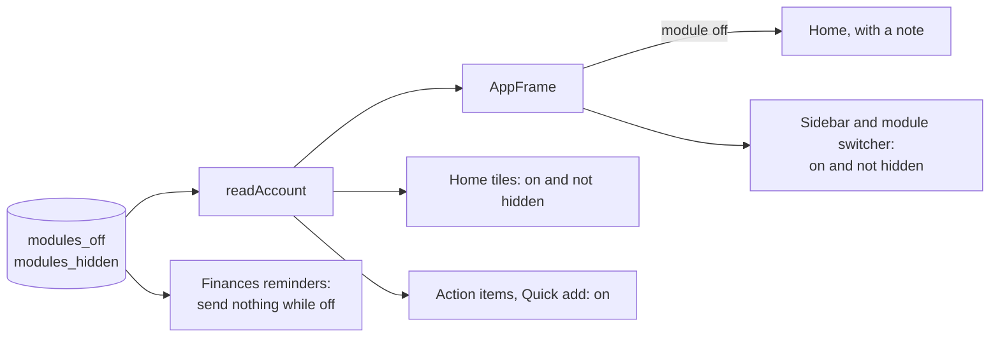
```mermaid
flowchart LR
  DB[(modules_off<br/>modules_hidden)] --> Account[readAccount]
  Account --> Frame[AppFrame]
  Frame -->|module off| Home["Home, with a note"]
  Frame --> Nav[Sidebar and module switcher:<br/>on and not hidden]
  Account --> HomeTiles[Home tiles: on and not hidden]
  Account --> Items[Action items, Quick add: on]
  DB --> Job[Finances reminders:<br/>send nothing while off]
```

Every signed-in page already reads the account for its menu, so that
read now brings the module view along, and every module page sits in
`AppFrame`, which is where a link to a module that's off turns into a
trip to Home. If the switches can't be read, everything counts as on.
The Finances reminders job asks for itself and fails instead of
guessing. While Finances is off its months still open and close on the
database's schedule; only the pushes stop. No module creates starter
rows today, so turning on one that was left out at setup has nothing to
set up yet.

## Not yet built

These are deliberately absent at this stage, not overlooked:

- **Little state** — the forms' pending/error state, the notifications
  control, which checks the device when the page opens and changes as the
  phone's question is answered, and which sheet is open.
- **Screens still to design** — Sign-in, sign-up and set-password have
  no mockup, so they keep a plain layout in the design's fonts and
  colours.
- **Three-paycheck months** — REQ-93's item waits on REQ-62, now in
  Draft.

Each of these will get its own entry in this document (and likely its own
diagram) once it exists.
