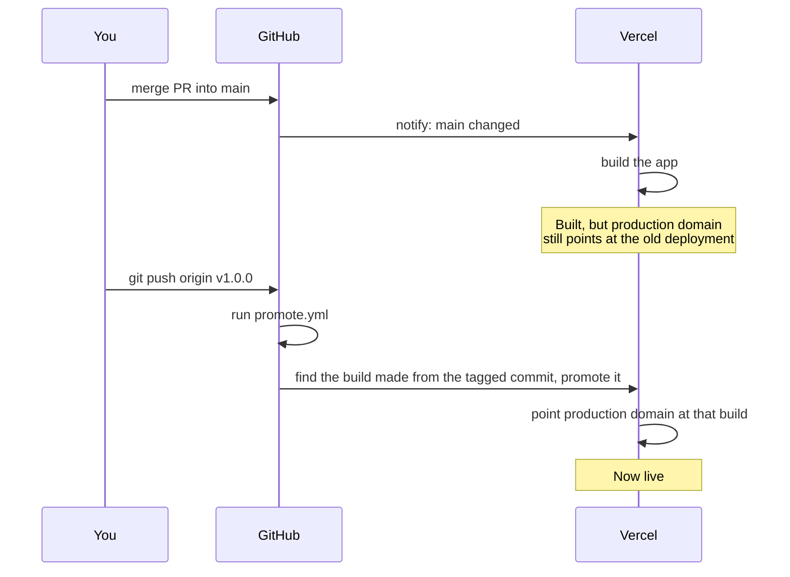

# Lesson 03: Tags, releases, and why "build" and "promote" are different steps

A new workflow ([`.github/workflows/promote.yml`](../../.github/workflows/promote.yml))
only assigns the production domain when a version tag is pushed. This
explains the pieces behind that: what a tag is, what a release is, and why
"build" and "promote" are two separate steps instead of one.

## What a git tag is

A commit is a snapshot of the code. A branch (like `main`) is a
moving label — it always points at the latest commit pushed to it. A
**tag** is the opposite: a label that points at one specific commit and
never moves again, even after `main` keeps changing.

`v1.0.0` is a typical tag name. The workflow's trigger is
`v[0-9]+.[0-9]+.[0-9]+` — a strict pattern requiring `v` followed by
exactly three dot-separated groups of digits, so `v1.0.0` and `v1.2.3`
match, but `v2.0.0-beta`, `vfoo`, or a typo like `v.0.0.1` (an extra dot
right after `v`) do not. See "Tightening the trigger" below for why this
got stricter than a plain `v*`.

```bash
git tag v1.0.0        # label the current commit
git push origin v1.0.0  # send that label to GitHub
```

Pushing a tag is a deliberate act — nothing creates one automatically. That
deliberateness is the whole point here: it's the moment we're choosing to
say "this exact commit is what should be live," as opposed to every merge
to `main` being an implicit vote for going live.

## What a GitHub release is

A **release** is a tag plus extra packaging on GitHub's side — release
notes, a title, and optionally file attachments. Every release points to a
tag, but not every tag has to become a release. For this workflow, only the
tag matters (the trigger fires on the tag itself); writing a GitHub
release around that tag is optional polish for communicating what
changed, not something the workflow depends on.

## Why "build" and "promote" are separate steps

Vercel is connected to this repo so that every merge to `main` triggers a
build automatically. Normally, Vercel would also point the production
domain at that new build right away. This project has that automatic step
turned off ("Auto-assign Custom Production Domains" is disabled in Vercel's
project settings), so a merge to `main` produces a fully built, working
deployment — reachable at its own unique Vercel URL — that visitors on the
production domain still won't see, because nothing has pointed the domain
at it yet.

**Promoting** is the second, separate step: taking a deployment that
already exists and already built successfully, and telling Vercel "make
this the one the production domain shows."

Splitting these into two steps means a bad merge to `main` can sit there,
built but harmless, for as long as needed — nobody sees it until a tag
says otherwise. It also means production only changes on a version bump we
chose on purpose, not on every commit that happened to land on `main`
first.

## Which address is production, and the trap in answering that

Production is **`home-base-peach.vercel.app`**.

Vercel hands a project several addresses, and only one of them is the
one promote points at:

| Address | What it follows |
|---|---|
| `home-base-peach.vercel.app` | **Production.** Only moves when `promote.yml` runs, on a tag |
| `home-base-home-base12.vercel.app` | The newest production *build* — every merge to `main` |
| `home-base-git-<branch>-…vercel.app` | That branch's latest build |

The second one is the trap, and it caught a Claude session on 2026-09-20
badly enough to be worth writing down. `vercel project ls` prints it in
a column headed **"Latest Production URL"**. It is not the production
URL. It is the newest build, which for a project that builds `main` on
every merge means it moves whenever you merge.

Having read that column, the session watched the address change after a
merge, concluded that merging was releasing, and edited five documents —
including CLAUDE.md's merging rule — to say so. All of it was wrong, and
all of it had to be undone.

**The check that settles it in seconds:**

```bash
gh run list --workflow=promote.yml
```

If the last successful run is days old, production has not moved in
days, whatever any alias is doing. Or ask the address itself: on
2026-09-20 production answered `404` for `/sign-in`, because it was
still serving a commit from before sign-in existed.

The general lesson is not about Vercel. **A label written by a tool is
not a fact about your system.** "Latest Production URL" was accurate on
its own terms — it is the latest build targeting production — and
completely misleading as an answer to "what are visitors seeing?". When
a dashboard and a workflow you wrote disagree, the workflow's run
history is the evidence; the dashboard is a description.



## What the workflow actually does

1. Triggers when a tag matching `v[0-9]+.[0-9]+.[0-9]+` is pushed.
2. Asks the Vercel API for production-target deployments (the "production
   target" is Vercel's own label for `main`-branch builds, separate from
   whether the domain has been assigned to one yet), and picks out the one
   whose commit SHA matches the commit the tag points to. If none matches,
   the workflow fails and production is left as it was — see "The promote
   step must target the tagged commit" below for why this isn't just "the
   latest one."
3. Runs `vercel promote <that deployment> --yes`, using the Vercel CLI, to
   assign the production domain to it.

Authentication uses a token stored as a GitHub secret
(`VERCEL_TOKEN`, alongside `VERCEL_ORG_ID` and `VERCEL_PROJECT_ID` to
identify which Vercel project to act on) — never written in the workflow
file itself. GitHub injects secrets into the job as environment variables
at run time and masks them in the logs.

## A real failure: "User not found (404)"

The first real tag push (`v.0.0.1`) hit this on the promote step:

```
Run vercel promote "https://home-base-3suw32j67-home-base12.vercel.app" --token="$VERCEL_TOKEN" --yes
Error: User not found. (404)
```

The lookup step worked fine — it found the right deployment. The failure
was specifically the Vercel CLI not knowing *which account or team* to act
as. Setting `VERCEL_ORG_ID` and `VERCEL_PROJECT_ID` as environment
variables is enough for some Vercel CLI commands (like `vercel deploy`) to
infer that automatically, but `vercel promote` needed it spelled out
explicitly with a `--scope` flag pointing at the org ID. The fix was
adding `--scope="$VERCEL_ORG_ID"` to the promote command.

The lesson: environment-variable-based project linking isn't guaranteed to
apply the same way across every Vercel CLI subcommand — when a command
touches account/team-scoped resources, pass the scope explicitly rather
than relying on it being inferred.

## A second real failure: token scoped too narrowly

Adding `--scope` didn't fully fix it — the next tag push failed with a
slightly different error:

```
Error: Not able to load user because of unexpected error: User not found. (404)
```

The telling clue: the "find latest deployment" step, which calls the
Vercel API directly with the same token, kept working. Only `vercel
promote` failed. That split matters — it means the token was valid and
could read data, but couldn't do something `vercel promote` specifically
needs: confirm *whose* token this is at the account level.

The actual cause turned out to be how the token was created. Vercel lets
you scope a token narrowly to a single project — enough to read that
project's deployments, but not enough for an operation like `promote`,
which needs the broader account identity behind the token, not just
project-level data access. The fix was regenerating the token without a
per-project restriction.

**Why this was hard to diagnose from the error alone:** "User not found"
sounds like an invalid or revoked token, not "valid token, insufficient
scope." That mismatch between symptom and cause is exactly why a
dedicated `vercel whoami` step was added to the workflow, running before
anything else: it isolates "can this token authenticate as a user at
all?" as its own question, with its own direct error, instead of that
check being buried inside a more complex command's failure.

## Tightening the trigger

The very first tag ever pushed, `v.0.0.1`, had a typo — an extra dot
right after `v`. It still triggered the workflow, because `v*` means
"starts with `v`," and `v.0.0.1` does. The workflow ran fine (the typo
didn't break anything downstream), but it was luck, not correctness: a
looser pattern than intended just happened not to matter that time.

The trigger is now `v[0-9]+.[0-9]+.[0-9]+`, which only matches a real
`v<major>.<minor>.<patch>` shape. A typo like `v.0.0.1`, an accidental
non-release tag, or a pre-release suffix like `v1.0.0-rc1` won't trigger
a promotion anymore — which is the point: this workflow moves the
production domain, so it should only ever fire on something that's
unambiguously a real version.

## The tag now matches a version the code already states

Every tag pushed before this point (`v0.0.1`, `v0.0.2`, `v0.0.3`) was
picked after the fact — nothing in the actual code said "this is
0.0.3," the number only existed in the git tag itself. `package.json`
had sat at `0.1.0` the entire time, unrelated to any of them.

Going forward, the order is reversed: `package.json`'s `version` field
and this changelog get bumped together, in the pull request, *before*
anything is tagged. That PR merges to `main` like any other. Only then
does a tag get pushed — and by that point, the code already agrees with
the tag about what version it is. If you ever open `package.json` on a
running deployment, its `version` field is a second, code-level way to
know what release it's supposed to be — independent of
[the branch-name limitation](04-build-time-env-vars.md) in the on-page
build info, which still shows `main` rather than the tag, since building
still happens on merge, before the tag exists.

## The promote step must target the tagged commit

The workflow originally asked Vercel for "the most recent production-target
deployment" and promoted whatever came back — on the assumption that the
release PR's merge to `main` would always be the newest build by the time
its tag was pushed.

That assumption breaks the moment a second PR merges to `main` *after* the
release PR but *before* its tag is pushed — an easy thing to do by
accident, since nothing stops other merges from landing in that window.
"Latest" would then point at that second, un-released commit, and pushing
the release tag would put unreleased code on the production domain even
though the tag's own commit was never asked for.

The fix: instead of taking the first deployment the Vercel API returns,
the workflow now asks for a page of recent production-target deployments
and filters them down to the one whose `meta.githubCommitSha` equals
`$GITHUB_SHA` — which GitHub Actions sets to the commit the pushed tag
points to, not whatever commit `main` happens to be at when the workflow
runs. If no deployment matches, the job fails with `::error::` and exits
non-zero rather than falling back to "closest guess" — production stays on
whatever it was already running.

This is also why the lookup step now asks for `limit=100` instead of
`limit=1`: it needs enough recent history to have a real chance of
containing the tagged commit's build, since that commit is no longer
guaranteed to be the newest one.
