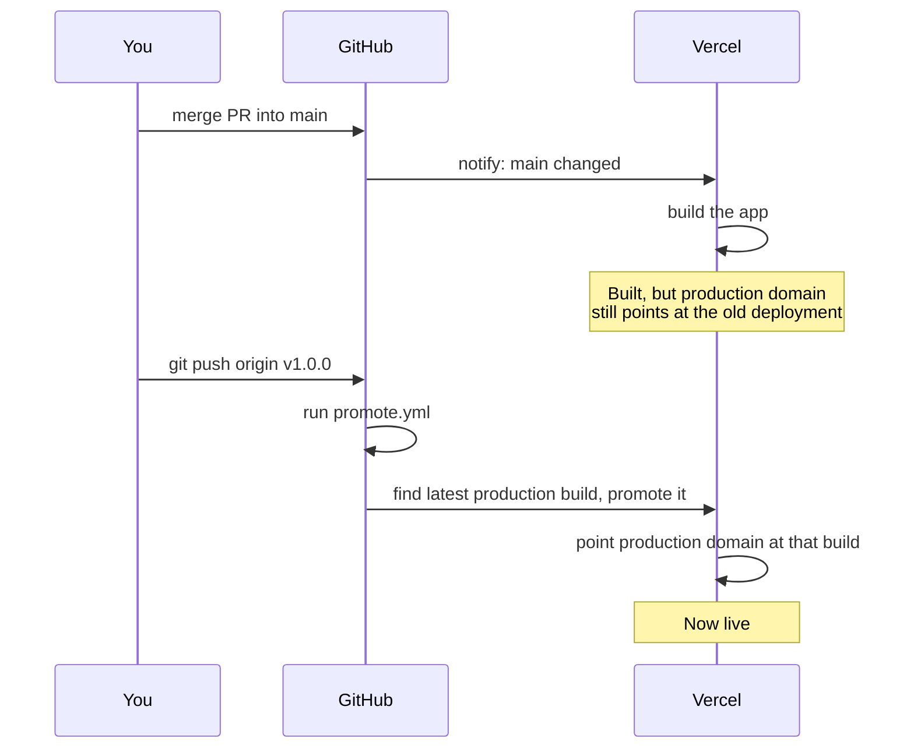

# Lesson 03: Tags, releases, and why "build" and "promote" are different steps

A new workflow ([`.github/workflows/promote.yml`](../../.github/workflows/promote.yml))
only assigns the production domain when a version tag is pushed. This
explains the pieces behind that: what a tag is, what a release is, and why
"build" and "promote" are two separate steps instead of one.

## What a git tag is

A commit is a snapshot of the code. A branch (like `main`) is a
moving label — it always points at the latest commit pushed to it. A
**tag** is the opposite: a label that points at one specific commit and
never moves again, even after `main` keeps changing.

`v1.0.0` is a typical tag name. The `v*` in the workflow's trigger means
"any tag starting with `v`" — so `v1.0.0`, `v1.2.3`, `v2.0.0-beta` would
all match.

```bash
git tag v1.0.0        # label the current commit
git push origin v1.0.0  # send that label to GitHub
```

Pushing a tag is a deliberate act — nothing creates one automatically. That
deliberateness is the whole point here: it's the moment we're choosing to
say "this exact commit is what should be live," as opposed to every merge
to `main` being an implicit vote for going live.

## What a GitHub release is

A **release** is a tag plus extra packaging on GitHub's side — release
notes, a title, and optionally file attachments. Every release points to a
tag, but not every tag has to become a release. For this workflow, only the
tag matters (the `push: tags: v*` trigger fires on the tag itself); writing
a GitHub release around that tag is optional polish for communicating what
changed, not something the workflow depends on.

## Why "build" and "promote" are separate steps

Vercel is connected to this repo so that every merge to `main` triggers a
build automatically. Normally, Vercel would also point the production
domain at that new build right away. This project has that automatic step
turned off ("Auto-assign Custom Production Domains" is disabled in Vercel's
project settings), so a merge to `main` produces a fully built, working
deployment — reachable at its own unique Vercel URL — that visitors on the
production domain still won't see, because nothing has pointed the domain
at it yet.

**Promoting** is the second, separate step: taking a deployment that
already exists and already built successfully, and telling Vercel "make
this the one the production domain shows."

Splitting these into two steps means a bad merge to `main` can sit there,
built but harmless, for as long as needed — nobody sees it until a tag
says otherwise. It also means production only changes on a version bump we
chose on purpose, not on every commit that happened to land on `main`
first.



## What the workflow actually does

1. Triggers when a tag matching `v*` is pushed.
2. Asks the Vercel API for the most recent deployment built from `main`
   (the "production target" — this is Vercel's own label for
   `main`-branch builds, separate from whether the domain has been
   assigned to it yet).
3. Runs `vercel promote <that deployment> --yes`, using the Vercel CLI, to
   assign the production domain to it.

Authentication uses a token stored as a GitHub secret
(`VERCEL_TOKEN`, alongside `VERCEL_ORG_ID` and `VERCEL_PROJECT_ID` to
identify which Vercel project to act on) — never written in the workflow
file itself. GitHub injects secrets into the job as environment variables
at run time and masks them in the logs.

## A real failure: "User not found (404)"

The first real tag push (`v.0.0.1`) hit this on the promote step:

```
Run vercel promote "https://home-base-3suw32j67-home-base12.vercel.app" --token="$VERCEL_TOKEN" --yes
Error: User not found. (404)
```

The lookup step worked fine — it found the right deployment. The failure
was specifically the Vercel CLI not knowing *which account or team* to act
as. Setting `VERCEL_ORG_ID` and `VERCEL_PROJECT_ID` as environment
variables is enough for some Vercel CLI commands (like `vercel deploy`) to
infer that automatically, but `vercel promote` needed it spelled out
explicitly with a `--scope` flag pointing at the org ID. The fix was
adding `--scope="$VERCEL_ORG_ID"` to the promote command.

The lesson: environment-variable-based project linking isn't guaranteed to
apply the same way across every Vercel CLI subcommand — when a command
touches account/team-scoped resources, pass the scope explicitly rather
than relying on it being inferred.

## A second real failure: token scoped too narrowly

Adding `--scope` didn't fully fix it — the next tag push failed with a
slightly different error:

```
Error: Not able to load user because of unexpected error: User not found. (404)
```

The telling clue: the "find latest deployment" step, which calls the
Vercel API directly with the same token, kept working. Only `vercel
promote` failed. That split matters — it means the token was valid and
could read data, but couldn't do something `vercel promote` specifically
needs: confirm *whose* token this is at the account level.

The actual cause turned out to be how the token was created. Vercel lets
you scope a token narrowly to a single project — enough to read that
project's deployments, but not enough for an operation like `promote`,
which needs the broader account identity behind the token, not just
project-level data access. The fix was regenerating the token without a
per-project restriction.

**Why this was hard to diagnose from the error alone:** "User not found"
sounds like an invalid or revoked token, not "valid token, insufficient
scope." That mismatch between symptom and cause is exactly why a
dedicated `vercel whoami` step was added to the workflow, running before
anything else: it isolates "can this token authenticate as a user at
all?" as its own question, with its own direct error, instead of that
check being buried inside a more complex command's failure.
