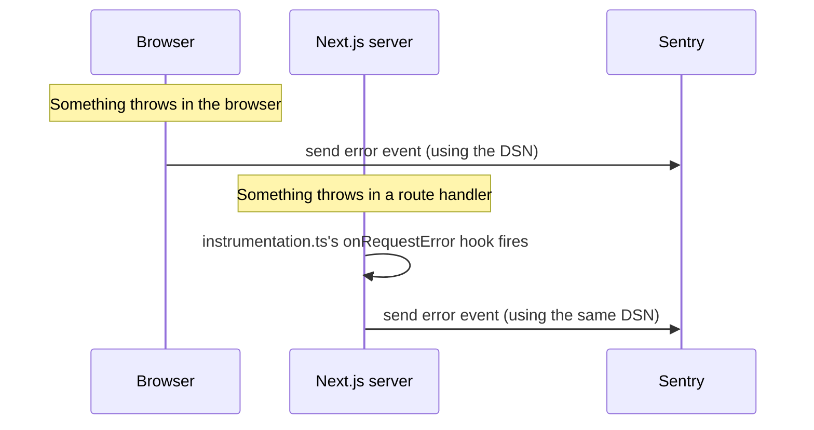

# Lesson 05: Sentry error tracking

The app now reports errors — from the browser and from the server — to
Sentry. This explains what Sentry actually is, what a "DSN" is, what shows
up when an error fires, and how to remove the deliberate test errors once
you've confirmed it's working.

## What Sentry does

Right now, if something breaks for a real visitor, nobody finds out unless
that visitor happens to tell you. Sentry closes that gap: it's a service
that collects errors as they happen — in the browser, on the server,
wherever — and puts them in one dashboard with the information needed to
actually fix them: the stack trace (which line failed), what the user was
doing (which page, which browser), and how often it's happening.

Without it, you're relying on someone noticing and reporting a bug. With
it, you find out the moment it happens, with enough detail to reproduce it.

## What a DSN is

DSN stands for "Data Source Name." It's a URL, unique to your Sentry
project, that looks something like:

```
https://abc123@o000000.ingest.sentry.io/000000
```

Think of it as a mailing address: it tells the Sentry SDK running in your
app exactly which Sentry project to send error reports to. It is **not** a
secret in the usual sense — unlike an API key that grants read/write
access to your account, a DSN can only be used to *send* new error events
to one specific project. Someone with your DSN can spam your project with
fake errors, which is mildly annoying, but they can't read your data,
your other projects, or anything else in your account with it. That's why
it's safe to use as a `NEXT_PUBLIC_` environment variable here — it ends
up visible in the browser's JavaScript bundle either way, and that's fine
by design.

## What shows up when an error fires

Two deliberate test errors exist at [`/sentry-test`](../../app/sentry-test/page.tsx)
(covered below) to confirm this works before relying on it. When either
fires, expect a new **Issue** to appear in the Sentry project's dashboard
within a few seconds, showing:

- The error message and full stack trace, pointing at the exact file and
  line that threw
- Whether it happened in the browser or on the server (a different
  "environment"/runtime tag for each)
- The URL/route where it happened
- A count that increases if the same error happens again, instead of
  creating duplicate issues for every occurrence

Because this project skips source map upload (see "What's not included"
below), the stack trace you see in Sentry will point at built/minified
code rather than the original source lines — still enough to identify
which route or file is responsible, just less precise than it could be.

## How the pieces fit together



Three small config files do the actual reporting:

- `instrumentation-client.ts` — initializes Sentry in the browser
- `sentry.server.config.ts` / `sentry.edge.config.ts` — initializes Sentry
  on the server (Next.js runs on two different server runtimes depending
  on the route; both need their own init)
- `instrumentation.ts` — Next.js's own hook system. It loads whichever of
  the two server configs matches the current runtime, and wires up
  `onRequestError` so that when a route handler or page throws on the
  server, Sentry hears about it automatically

## The deliberate test errors — and removing them later

[`/sentry-test`](../../app/sentry-test/page.tsx) has two buttons:

- **Throw client error** — throws directly in the browser, to confirm the
  browser-side reporting path
- **Throw server error** — calls
  [`/api/sentry-test`](../../app/api/sentry-test/route.ts), which throws
  on the server, to confirm the server-side reporting path

Once you've clicked both and confirmed two new Issues showed up in
Sentry's dashboard, this page and its API route are no longer needed —
delete `app/sentry-test/` and `app/api/sentry-test/` (and their test file,
`app/sentry-test/page.test.tsx`).

## What's not included

**Source map upload** was left out on purpose to keep the setup minimal —
it needs an additional Sentry auth token as a secret, and its only benefit
is prettier (de-minified) stack traces in the dashboard. Errors are
reported and catchable either way; this would just make them easier to
read. Worth adding later if the minified stack traces become a real
annoyance.

**Performance monitoring** (Sentry can also track how slow requests are,
not just errors) is also not enabled — this setup only reports errors, per
what this issue asked for.
