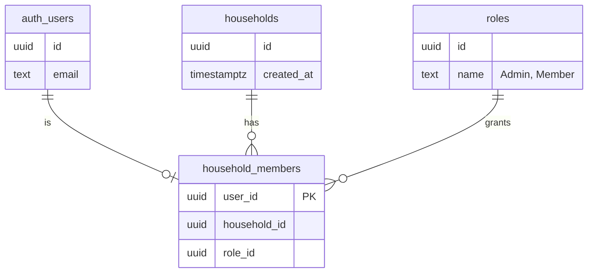

# Lesson 07: Supabase, migrations, and letting the database enforce a rule

REQ-10 ("first sign-up creates the household and its admin") is the first
requirement that needs somewhere to keep data and a way to know who is
asking. This lesson covers the pieces that arrived with it: what Supabase
is, how database changes travel through git, and why the most important
rule in this feature lives in the database rather than in the app.

## What Supabase is

Supabase is three things bundled behind one URL:

- **Postgres** — a normal relational database. Tables, rows, SQL.
- **Auth** — sign-up, sign-in, sessions. It keeps its own `auth.users`
  table; our tables never store passwords.
- **An API** — every table in the `public` schema is reachable over HTTP
  without us writing an endpoint for it. That is convenient and dangerous
  in equal measure, which is what row-level security (below) is for.

The app talks to it with two values, both set on Vercel by the
Vercel–Supabase integration and pulled into a gitignored `.env.local` for
local work with `npx vercel env pull .env.local`:

| Variable | What it is |
|---|---|
| `NEXT_PUBLIC_SUPABASE_URL` | Where the project lives. |
| `NEXT_PUBLIC_SUPABASE_PUBLISHABLE_KEY` | Identifies the app to Supabase. "Publishable" means it is *designed* to be visible in the browser — it grants no access on its own. Access is decided per row by the database (see RLS). |

`NEXT_PUBLIC_` is Next.js's convention for "this may be shipped to the
browser". Anything without that prefix stays on the server.

The code side is small: [`lib/supabase/server.ts`](../../lib/supabase/server.ts)
builds a client for server code, and it uses `@supabase/ssr` so the login
session travels in a cookie the way a normal website's does, instead of
living only in browser memory.

One ordering detail in that file cost a red CI run. GitHub Actions builds
the app with **no** Supabase env vars — they live only in Vercel, on
purpose. `next build` tries to pre-render every page it can, and a page
becomes "dynamic" (skipped by pre-rendering) the moment it calls
`cookies()`. The first version checked the env vars *before* calling
`cookies()`, so the build hit the "missing env" error while still trying to
pre-render `/`. Locally it passed only because `.env.local` existed.
Calling `cookies()` first fixes it, and a test now pins that order.

## Migrations: database changes that travel through git

A **migration** is a file of SQL that changes the database's *structure*
— create a table, add a column, define a function. They live in
`supabase/migrations/`, one file per change, named with a timestamp so
they apply in order. The first one is
[`20260918140000_households_roles_and_members.sql`](../../supabase/migrations/20260918140000_households_roles_and_members.sql).

Why not just click "New table" in the Supabase dashboard? Because then
the database's shape would exist only in that one project, invisible to
git and to anyone reading the repo. With migrations, the repo *is* the
description of the database, reviewable in a pull request like any other
change, and a fresh project can be brought to the same shape by replaying
the files. CLAUDE.md makes this a rule: structure changes go through
migration files, never by hand in the console.

Applying them uses the Supabase CLI, installed as a dev dependency so its
version is pinned in `package.json`:

```bash
npx supabase link --project-ref <ref>
```

```bash
npx supabase db push
```

`link` (once per machine) tells the CLI which hosted project this folder
belongs to. `db push` sends every migration file the project hasn't seen
yet. The CLI remembers which ones have run in a table of its own
(`supabase_migrations.schema_migrations`), so running `db push` twice is
harmless — nothing applies twice.

Analogy: migrations are the recipe, the database is the cake. You never
poke the cake directly; you change the recipe and bake again. Anyone with
the recipe can make the same cake.

`db push` started as a manual step — someone ran it after each merge,
which meant the code could reach previews and production before the
tables it needed existed. It is now automatic:
[`.github/workflows/migrate.yml`](../../.github/workflows/migrate.yml)
runs `db push` whenever a push to `main` touches `supabase/migrations/**`,
one run at a time, authenticating with two repository secrets
(`SUPABASE_ACCESS_TOKEN`, a personal token from the Supabase account
page, and `SUPABASE_DB_PASSWORD`, the project's database password). The
migration file is still reviewed in its pull request; the workflow only
replaces the button press, and a structural test pins that it can never
run for anything but `main`, never uses a literal password, and never
touches project settings (`config push`).

One trap next to it: `supabase config push` looks like the same idea for
*settings* (auth toggles, URLs, pool sizes) instead of tables — but the
`config.toml` that `supabase init` writes declares a default for nearly
every setting, and a push writes *every declared value*. Running the
read-only `npx supabase config diff` showed 13 differences against this
project, including switching off MFA and SMS that were set up on purpose.
So: `config diff` before ever considering `config push`, and until the
file is trimmed to only the settings we mean to manage, project settings
change in the dashboard.

### Amending a migration that already ran but hasn't merged

A migration on `main` is frozen: the workflow has run it, and changing the
result means a *new* file. A migration on an unmerged branch is different.
Because every feature is verified against the live project before it
merges, its migration has usually already been applied there — and if
review finds it wrong, the file can still be corrected in place: edit it,
run `npx supabase migration repair --status reverted <version> --linked`
(the version is the file's timestamp prefix) so the CLI's ledger forgets
the old version ever ran — the ledger only; SQL already applied stays
applied — then `npx supabase db push --linked` to apply the amended file.
The recipe changed before anyone else baked from it.

Three conditions. Only for migrations not yet on `main`. The amended SQL
must tolerate whatever the first version already did — `create or
replace` for functions, and never re-create a table or policy the first
version made unless the amendment drops it first. And the auto-migrate
workflow still runs on merge, finds the ledger up to date, and applies
nothing extra.

Seen once already: the first
[`20260918180000_admin_created_members.sql`](../../supabase/migrations/20260918180000_admin_created_members.sql)
(#51) checked `app_metadata` in an `AFTER INSERT` trigger, but Supabase's
admin API only writes `app_metadata` after the insert, so the trigger
never saw it. The amended version checks a `member_invitations` table.

**When the amendment doesn't need to reach the live project, skip the
dance on purpose.** The second condition above is a real gate, not
paperwork: `alter table ... add column` cannot tolerate having already
run, so repairing and re-pushing would simply fail, and the only way to
make it survive a replay is `if not exists` — weakening the file for
every future environment to work around a one-off. The way out is to ask
what the amendment actually changes on *this* database. In #52 it added
an `update` covering rows that existed before the column did; on the
hosted project that set was empty and always will be, so the statement
matches nothing there. The applied schema, the applied data, and what the
file produces on a fresh database all agree, and the file is simply left
to diverge from the ledger.

The price is honest and worth naming: that `update` has never executed
anywhere. Its whole coverage is a test asserting the line exists, and it
will run for real the first time someone builds a fresh database. The
judgement is "this line is three tokens against a column I have
confirmed", not "this is verified".

### One migration pull request at a time

The same fact behind the section above — migrations reach the live project
*before* they reach `main` — has a second consequence, and this one bites
at merge time.

Two pull requests were open, each adding a migration, both already applied
to the hosted project during verification. Merging the first one made
[`migrate.yml`](../../.github/workflows/migrate.yml) fail on `main`:

```
Remote migration versions not found in local migrations directory.
```

`main` now had `20260919100000` and not `20260919120000`, while the CLI's
ledger on the remote had both. `db push` refuses to reason about a
database that has run something the repo can't show it.

**The tempting diagnosis is "merge them in timestamp order", and it is
wrong.** The failure is symmetric. Merging the other one first would have
left `main` missing `20260919100000` and failed in exactly the same words.
Repairing the ledger doesn't rescue it either; it just moves the failure
to whichever merge comes second. The window *between* two migration merges
is always red, whatever you do inside it. It went green the moment the
second one landed (#57, #52).

So the rule isn't about ordering. **Finish and merge a migration pull
request before opening the next one.** That cuts against the habit the
rest of this project encourages, where independent pull requests sit side
by side happily — and that is exactly why it's written down. The
exception isn't arbitrary: ordinary pull requests only touch files, so
`main` is the whole truth about them. A migration touches a database that
remembers, and two sources of truth have to agree.

If two are already open, merge them back to back and accept one red run.
Expect them to conflict each other on `CHANGELOG.md` and
`supabase/schema.test.ts` as they go, since both append to the top of one
and the bottom of the other.

## The data model



Three tables. `roles` holds Admin and Member as *rows* — REQ-12 will add a
permissions column, and a future role is a new row rather than new code.
`household_members` joins a user to a household with a role; `user_id`
being the primary key is what makes "one household per person" true
without any extra code.

## Letting the database enforce the rule

The rule is: the first sign-up creates the household and becomes Admin;
every sign-up after that is refused. The app *could* check this before
calling sign-up — and it does, as a courtesy, so the form is hidden once
a household exists. But the app is not the only thing that can reach
Supabase's sign-up endpoint. Anyone who can see the publishable key
(everyone — it's in the page) could call it directly.

So the rule lives in a **trigger**: a Postgres function that runs
automatically whenever a row is inserted into `auth.users`. It checks
whether a household exists; if not, it creates one and inserts the new
user as Admin; if so, it raises an error, which makes the whole sign-up
fail. There is no path around it, because it fires inside the database
on the very action being guarded.

Two details in that function worth knowing:

- `security definer` — the function runs with the permissions of the
  role that *defined* it, not the role *calling* it. The sign-up flow
  runs as a signed-out visitor who can't write to `households`; the
  function can, because it was defined by the project owner.
- `set search_path = ''` — forces every table name in the function to be
  fully qualified (`public.households`, not `households`). Without it, a
  caller could in theory create a same-named table somewhere the function
  would find first. Belt and braces for any `security definer` function.

Seen live: a sign-up sent straight to Supabase's `/auth/v1/signup`
endpoint, bypassing the app, came back `HTTP 500` with
`{"code":"P0001","message":"Sign-up is closed: the household already exists"}`
— the trigger's own message. The app doesn't rely on that wording, though:
[`app/sign-up/actions.ts`](../../app/sign-up/actions.ts) re-checks whether
a household exists after any sign-up error and shows its own explanation.

## Row-level security, switched on with no policies

Every new table has RLS enabled and — for now — no policies. In Supabase
terms that means: the API can neither read nor write those tables, full
stop. A locked door with no keys cut yet. REQ-12 cuts the keys
(policies) deliberately, per role and per permission.

The one thing a signed-out visitor *can* do is ask "does a household
exist yet?", via a `security definer` function called `household_exists`
that returns only a boolean. It is a keyhole, not a door: it reveals
whether sign-up is open and nothing else.

## Sign-up form: Server Actions

The form posts to a **Server Action** — a function marked `"use server"`
that Next.js runs on the server when the form submits, with no API route
to write. The client component wraps it with React's `useActionState`,
which hands back the action's result (an error message, if any) and a
`pending` flag for disabling the button while it runs. On success the
action calls `redirect("/")`.

## Two things to know about the live project

**One Supabase project serves local, preview, and production.** That means
the first *test* sign-up becomes the real household. Before the v0.1
release, delete the test household — and mind the order: delete the row in
`households` first (Table editor), which cascades its `household_members`
rows away, then delete the test users (Authentication → Users). The other
order is refused, because the last admin's account can't be deleted while
the household still stands (see [lesson 12](12-the-member-ledger.md)).
That is changing *data*, not structure, so it's allowed by hand. A second
project for dev can come later.

**Test emails must be real mailboxes.** Supabase's hosted Auth refused
both `first-admin@example.com` (a reserved documentation domain) and
`first-admin@homebase-test.app` (a made-up domain) with "Email address is
invalid" — it checks that the domain can actually receive mail, not just
that the address is well-formed. The sign-up form showed that message
inline, which was the first real proof the error path works. So a test
account needs an address you control; a `+tag` on your own mailbox (for
example `you+homebase-test@gmail.com`) keeps it clearly test data while
still being deliverable. The unit tests keep using `@example.com` because
they never reach Supabase.

**Email confirmation.** Supabase Auth has a "Confirm email" setting. It
is a *project* setting, not an account one: open the project, then
Authentication → Sign In / Providers → expand the Email row. With it on, sign-up has to
*send* an email before anything else happens — and Supabase's built-in
sender allows only a handful of messages per hour, so the very first
deliverable test address came back with `email rate limit exceeded` and no
user was created. Even when the mail does go out, there is no session
until the link in it is clicked. For a two-person household app that step
is friction with no upside; turning it off is an auth setting, not a
structure change, and REQ-11's sign-in flow assumes it's off. With it off,
sign-up creates the user, the trigger creates the household, and the
person is signed in immediately.
